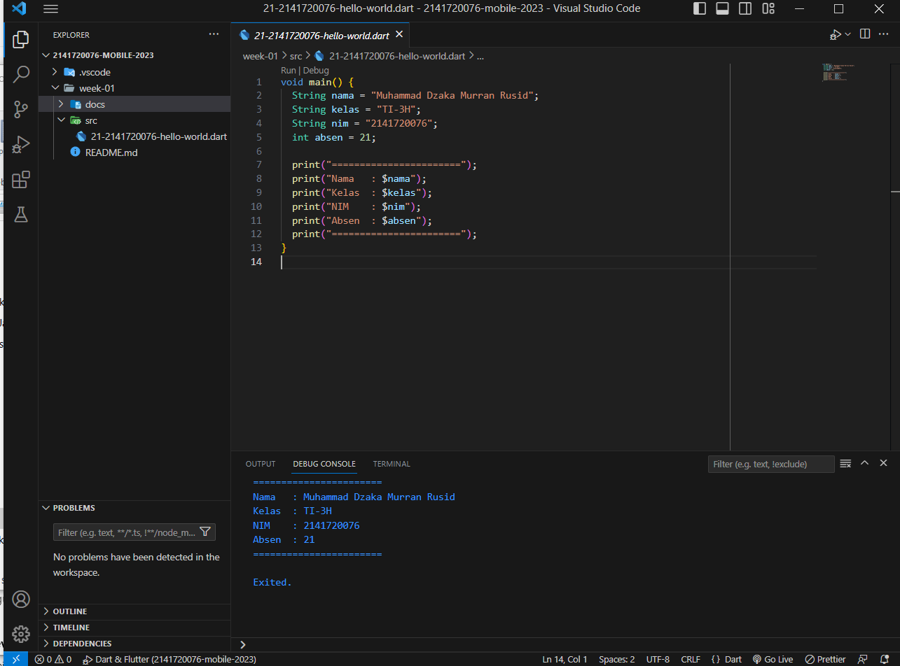

# Week 01 - Dasar Dart

Di minggu kesatu ini, mahasiswa diperkenalkan dengan framework flutter dan bahasa dart. Kemudian memulai menginstall setiap tools yang diperlukan dan membuat program hallo world sederhana menggunakan bahasa dart.

## Penulis

>> [@dzkmrn](https://www.github.com/dzkmrn)

## Tahapan

- Bukti Dart telah terinstall
 

- Bukti konfigurasi vscode
 

- Bukti Program "Hello, World" (modifikasi) 
 