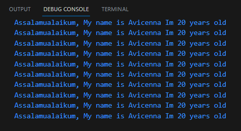

# Week 02 - Pengenalan Dart

Di minggu kedua ini, mahasiswa akan mempelajari dart, fiturnya, cara kerjanya, dan dasar pemrogramannya.

## Penulis

>> [@dzkmrn](https://www.github.com/dzkmrn)

## Tugas Praktikum

### Soal 1
Modifikasi kode perulangan dan penerapan konsep OOP

**Faylasuf.dart**
```dart
class Faylasuf {
  int? umur;
  String? nama;

  Faylasuf(this.umur, this.nama);

  int? getUmur() {
    return umur;
  }

  String? getNama() {
    return nama;
  }
}
```
<br>

**Falsafah-app**
```dart
import 'Faylasuf.dart';

void main() {
  Faylasuf faylasuf = new Faylasuf(20, "Avicenna");

  for (var i = 1; i <= 10; i++) {
    print(
        "Assalamualaikum, My name is ${faylasuf.getNama()} Im ${faylasuf.getUmur()} years old");
  }
}
```
<br>

**OUTPUT**



### Soal 2
Mengapa sangat penting untuk memahami bahasa pemrograman Dart sebelum kita menggunakan framework Flutter ? Jelaskan!

```
Jawaban: Karena bahasa pemrograman yang digunakan dalam membangun aplikasi dengan Framework Flutter adalah Dart, sehingga sintaksisnya mengikuti Dart, dan tentunya pemrogram harus memahami Bahasa Dart.
```

### Soal 3
Rangkumlah materi dari codelab ini menjadi poin-poin penting yang dapat Anda gunakan untuk membantu proses pengembangan aplikasi mobile menggunakan framework Flutter.

#### Rangkuman Materi Pengenalan Dart
<hr>
<p>Dart awalnya diciptakan sebagai solusi untuk mengatasi kelemahan JavaScript yang tidak memiliki ketahanan. Namun, sekarang Dart telah berkembang menjadi bahasa yang digunakan secara luas dalam pengembangan perangkat mobile, terutama dengan framework Flutter. Dart memiliki sejumlah fitur tingkat tinggi yang memberikan keunggulan pada bahasa ini:<p>

- Alat Produktif: Dart memiliki alat produktif seperti analisis kode, plugin untuk lingkungan pengembangan terintegrasi (IDE), dan ekosistem paket yang luas.

- Pengelolaan Sampah (Garbage Collection): Dart memiliki mekanisme pengelolaan sampah yang membantu mengatur dealokasi memori, terutama mengatasi objek yang tidak lagi digunakan.

- Anotasi Tipe (Type Annotations, Opsional): Anotasi tipe dalam Dart dapat digunakan secara opsional, tetapi mereka membantu meningkatkan keamanan dan konsistensi dalam mengelola data dalam aplikasi.

- Tipe Statis: Meskipun anotasi tipe bersifat opsional, Dart tetap aman karena menerapkan tipe yang aman dan inferensi tipe untuk menganalisis tipe data selama kompilasi kode. Ini membantu dalam mendeteksi bug saat kompilasi.

- Portabilitas: Bahasa Dart tidak hanya digunakan untuk pengembangan web (yang dapat diterjemahkan ke JavaScript), tetapi juga dapat dikompilasi secara native ke platform ARM (Advanced RISC Machines) dan x86.

Eksekusinya dilakukan melalui dua cara: 
- JIT (Just-In-Time) Compilation: Digunakan saat pengembang sedang mengembangkan aplikasi Dart. Kode Dart dikompilasi menjadi bytecode saat aplikasi dijalankan, yang dieksekusi oleh mesin virtual Dart. Ini memungkinkan perubahan kode dinamis dan hot-reloading selama pengembangan.

- AOT (Ahead-Of-Time) Compilation: Digunakan saat Anda ingin mendistribusikan aplikasi Dart. Kode Dart dikompilasi sebelumnya menjadi kode mesin langsung, yang dapat dijalankan di platform target tanpa memerlukan mesin virtual Dart. Ini meningkatkan performa dan mengurangi ukuran aplikasi untuk distribusi.

### Soal 4
Buatlah slide yang berisi penjelasan dan contoh eksekusi kode tentang perbedaan Null Safety dan Late variabel ! (Khusus soal ini kelompok berupa link google slide)

```
Anggota Kelompok

Mohammad Izamul Fikri Fahmi (2141720171)
Muhammad Dzaka Murran Rusid (2141720076)
```
Link Slide dari Canva : [Klik untuk Menuju Slide](https://www.canva.com/design/DAFtc00esjY/HbqOsJ2jxFClf_FJUc4gkQ/edit?utm_content=DAFtc00esjY&utm_campaign=designshare&utm_medium=link2&utm_source=sharebutton)

