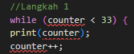
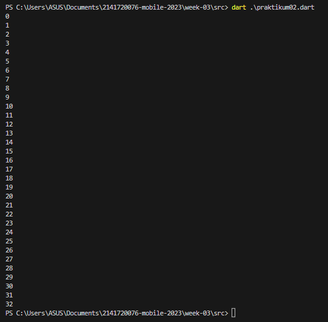
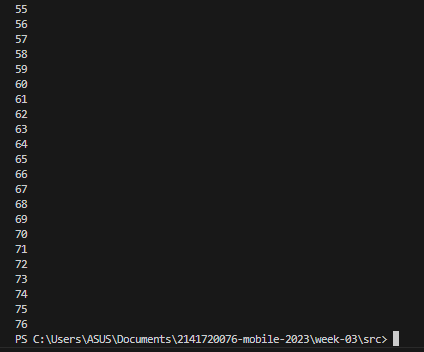
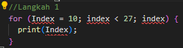
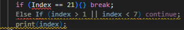
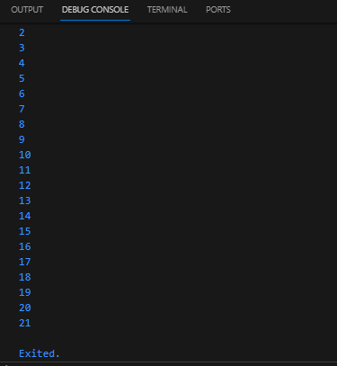
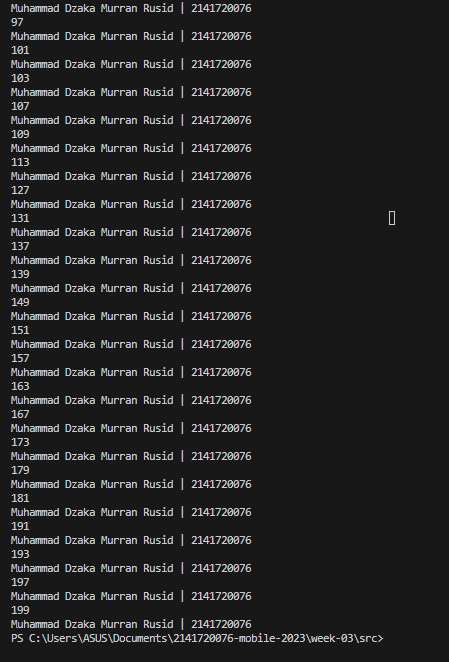

# Week 02 - Pengenalan Dart

Di minggu kedua ini, mahasiswa akan mempelajari dart, fiturnya, cara kerjanya, dan dasar pemrogramannya.

## Penulis

>> [@dzkmrn](https://www.github.com/dzkmrn)

## Tugas Praktikum

### Praktikum 1: Menerapkan Control Flows ("if/else")

1. Ketik atau salin kode berikut ke main()
    ```dart
    String test = "test2";
    if (test == "test1") {
    print("Test1");
    } else If (test == "test2") {
    print("Test2");
    } Else {
    print("Something else");
    }

    if (test == "test2") print("Test2 again");
    ```

2. Silakan coba eksekusi (Run) kode pada langkah 1 tersebut. Apa yang terjadi? Jelaskan!

    

    **Jawaban: Terjadi error dikarenakan banyaknya kesalahan sintaksis, sehingga setelah diperbaiki akan seperti berikut:**

    ```dart
    //Langkah 1
    String test = "test2";
    if (test == "test1") {
        print("Test1");
    } else if (test == "test2") {
        print("Test2");
    } else {
        print("Something else");
    }

    if (test == "test2") print("Test2 again");
    ``` 

    OUTPUT: 

    

3. Tambahkan kode program berikut, lalu coba eksekusi (Run) kode Anda.
    ```dart
    String test = "true";
    if (test) {
        print("Kebenaran");
    }
    ```

    **Jawaban: Terjadi errorjuga karena beberapa kesalahan sintaksis dan inisialisasi jenis variabel yang salah (harusnya bool bukan string). Selain itu nilai dari variabel test adalah true tanpa petik karena nilainya bukan string tapi boolean.**
    ```dart
    bool test2 = true;
    if (test2) {
        print("Kebenaran");
    }
    ```
    OUTPUT: 
    
    

### Praktikum 2: Menerapkan Control Flows ("if/else")

1. Ketik kode dan lihat resultnya

    

    **Jawaban: Terjadi error karena variabel counter belum diinisialisasikan dengan nilai konkrit (jangan null), setelah diberikan nilai sebagai landasan perulangan, barulah program tersebut dapat dijalankan.**
    ```dart
    //Langkah 1
    var counter = 0;
    while (counter < 33) {
        print(counter);
        counter++;
    }
    ```
    OUTPUT: 

    

2. Tambahkan kode program berikut, lalu lihat hasilnya

    ```dart
    do {
        print(counter);
        counter++;
        } while (counter < 77);
    ```

    OUTPUT: 

    

    Sama seperti tadi, bedanya kondisi counter diubah hingga ke 76


### Praktikum 3: Menerapkan Control Flows ("if/else")

1. Ketik dan lihat hasil dari kode pemrograman berikut: 

    

    **Jawaban: Terjadi error yang diakibatkan belum adanya inisialisasi variable index sebagai kondisi awal perulangan, kemudian setelah di-run pun akan terjadi infinite loop karena index belum dilakukan increment (index++) jadi apabila diubah kodenya akan seperti berikut:**

    ```dart
    for (var index = 10; index < 27; index++) {
        print(Index);
    }
    ```
2. Tambahkan kode program berikut di dalam for-loop, lalu coba eksekusi (Run) kode Anda.

    

    **Jawaban: Terjadi error lagi karena kesalahan sintaksis, diperbaiki dengan memasukkan kurung kurawal setelah kondisi if, kemudian masukkan perintah break ke dalam blok kode if, dan perintah continue ke blok kode else-if. Hasilnlya seperti berikut:**

    ```dart
    for (var index = 1; index < 27; index++) {
    print(index);
    if (index == 21) {
        break;
    } else if (index > 1 || index < 7) {
        continue;
    }
    print(index);
    }
    ```

    OUTPUT: 

    

    Perulangan akan berhenti ketika nilai di indeks telah teriterasi hingga ke angka 21 karena perintah break. Sehingga kondisi kedua yaitu continue tidak akan dijalankan. \


### TUGAS

Buatlah sebuah program yang dapat menampilkan bilangan prima dari angka 0 sampai 201 menggunakan Dart. Ketika bilangan prima ditemukan, maka tampilkan nama lengkap dan NIM Anda.

**Jawaban:**

Source Code: 

```dart
var dzaka = "Muhammad Dzaka Murran Rusid | 2141720076";
void main() {
  bool isPrime = false;
  for (var i = 2; i <= 201; i++) {
    isPrime = true;
    for (var j = 2; j <= i; j++) {
      if (j != i) {
        if (i % j == 0) {
          isPrime = false;
          break;
        }
      }
    }
    if (isPrime) {
      print(i);
      print(dzaka);
    }
  }
}
```
OUTPUT: 




