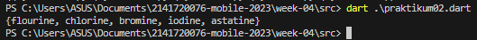

# Week 04 - Dart - List, Set, Maps, Record

Di minggu keempat ini, mahasiswa akan mempelajari dan bereksperimen pada list, set, maps, record, dan operator-operator berkaitan. Terakhir juga diberikan tugas untuk menguji pemahaman mahasiswa. 

## Penulis

>> [@dzkmrn](https://www.github.com/dzkmrn)

## Tugas Praktikum

### Praktikum 1: Eksperimen Tipe Data List

#### Langkah 1: 
Ketik atau salin kode program berikut ke dalam void main().

```dart
var list = [1, 2, 3];
assert(list.length == 3);
assert(list[1] == 2);
print(list.length);
print(list[1]);

list[1] = 1;
assert(list[1] == 1);
print(list[1]);
```

#### Langkah 2:

OUTPUT:


Program akan mencetak length dari list, nilai list index ke-1, dan nilai list index ke-1 yang baru setelah di assert, jadilah hasilnya 3,2,1.

#### Langkah 3: 
```dart
final List<String?> list2 = List.filled(5, null);
list2[1] = 'Muhammad Dzaka';
list2[2] = '2141720076';
assert(list2.length == 5);
assert(list2[1] == 2);
print(list2.length);
print(list2[1]);

assert(list2[1] == 1);
print(list2[2]);
```
Inisialisasi di awal diubah agar memiliki list memiliki length = 5 dan basis nilai null. 

### Praktikum 2: Eksperimen Tipe Data Set

#### Langkah 1: 
Ketik atau salin kode program berikut ke dalam fungsi main().

```dart
var halogens = {'fluorine', 'chlorine', 'bromine', 'iodine', 'astatine'};
print(halogens);
```

#### Langkah 2: 
OUTPUT: 



Disini tidak ada error dan semua nilai di set tersebut tercetak

#### Langkah 3: 
```dart
var names1 = <String>{};
Set<String> names2 = {};
var names3 = {};

print(names1);
print(names2);
print(names3);
```

Karena nilai dari set tersebut semua masih kosong, akan dimasukkan menggunakan add() dan addAll()

```dart
var names1 = <String>{};
Set<String> names2 = {};
var names3 = <String>{};
names1.addAll({'Dzaka'});
names2.add('2141720076');
names3.addAll(names1);
names3.addAll(names2);

print(names1);
print(names2);
print(names3);
```

OUTPUT: 


Yang harus dilakukan disini adalah gunakan addAll() atau add() untuk memberikan value ke set yang telalh dibuat, kemudian pada var names3 tambahkan tipe data String agar set tersebut dapat menerima value String dari names1 dan names2. 


### Praktikum 3: Eksperimen Tipe Data Maps

#### Langkah 1: 
Ketik atau salin kode program berikut ke dalam fungsi main() dan jalankan
```dart
var gifts = {
  // Key:    Value
  'first': 'partridge',
  'second': 'turtledoves',
  'fifth': 1
};

var nobleGases = {
  2: 'helium',
  10: 'neon',
  18: 2,
};

print(gifts);
print(nobleGases);
```
#### Langkah 2: 

OUTPUT:


Disini nilai dapat tercetak tanpa ada masalah, disetiap Maps, nilainya terdiri dari Key:Value. 


#### Langkah 3: 
```dart
var mhs1 = Map<String, String>();
gifts['first'] = 'partridge';
gifts['second'] = 'turtledoves';
gifts['fifth'] = 'golden rings';

var mhs2 = Map<int, String>();
nobleGases[2] = 'helium';
nobleGases[10] = 'neon';
nobleGases[18] = 'argon';
```

OUTPUT: 


Isi dari mhs1 dan mhs2 masih kosong karena penambahan nilainya salah, harusnya mhs1[key] = value, Sekarang ditambahkan nama dan nim di tiap variabel diatas:

```dart
print("Langkah 3:");
var mhs1 = Map<String, String>();
mhs1['first'] = 'partridge';
mhs1['second'] = 'turtledoves';
mhs1['fifth'] = 'golden rings';
mhs1['Nama'] = 'Muhammad Dzaka';
mhs1['NIM'] = '2141720076';

var mhs2 = Map<int, String>();
mhs2[2] = 'helium';
mhs2[10] = 'neon';
mhs2[18] = 'argon';
mhs2[21] = 'Muhammad Dzaka';
mhs2[22] = '2141720076';

print(mhs1);
print(mhs2);
```

OUTPUT: 


### Praktikum 4: Eksperimen Tipe Data List

#### Langkah 1: 
Ketik atau salin kode program berikut ke dalam fungsi main().

```dart
var list = [1, 2, 3];
var list2 = [0, ...list];
print(list1);
print(list2);
print(list2.length);
```

#### Langkah 2: 
OUTPUT: 


Disini kita menggunakan operator spread untuk menggabungkan nilai di list ke list2 kemudian dicetak nilai dan length-nya untuk melihat hasilnya dan panjang list-nya apakah benar sudah tergabung. 

#### Langkah 3: 
```dart 
list1 = [1, 2, null];
print(list1);
var list3 = [0, ...?list1];
print(list3.length);
```

Untuk menambahkan variabel list berisini NIM dan gunakan spread operator maka seperti berikut: 

```dart
  var list1a = <int?>[1, 2, null];
  print(list1a);
  var list3 = [0, ...?list1a];
  var Nim = [2141720076];
  var list4 = [list3, ...Nim];
  print(list3.length);
  print(list4);
```

OUTPUT: 


#### Langkah 4
Tambahkan kode program berikut, lalu coba eksekusi (Run) kode Anda.

```dart 
var nav = ['Home', 'Furniture', 'Plants', if (promoActive) 'Outlet'];
print(nav);
```

Diperbaiki

```dart
bool promoActive = true; // or false
var nav = ['Home', 'Furniture', 'Plants', if (promoActive) 'Outlet'];
print(nav);
```

OUTPUT: 

**True**


**False**


Terlihat dari kedua output tersebut, apabila bool promoActive bernilai true, maka nilai 'Outlet' akan masuk di list tersebut, begitupun sebaliknya, bila false, tidak akan masuk. 

#### Langkah 5: 
Tambahkan kode program berikut, lalu coba eksekusi (Run) kode Anda.
```dart
var nav2 = ['Home', 'Furniture', 'Plants', if (login case 'Manager') 'Inventory'];
print(nav2);
```

diperbaiki
```dart
print("Langkah 5 (login = lainnya):");
var login = 'Supervisor'; // or Manager
var nav2 = [
  'Home',
  'Furniture',
  'Plants',
  if (login case 'Manager') 'Inventory'
];
print(nav2);
```

OUTPUT:

**login = Manager**


**login = lainnya**


Terlihat juga di dua output di atas, apabila var login diberikan nilai manager maka inventory akan masuk menjadi nilai, berlaku sebaliknya. 

#### Langkah 6: 
Tambahkan kode program berikut, lalu coba eksekusi (Run) kode Anda.

```dart 
var listOfInts = [1, 2, 3];
var listOfStrings = ['#0', for (var i in listOfInts) '#$i'];
assert(listOfStrings[1] == '#1');
print(listOfStrings);
```
OUTPUT:


Collection for digunakan untuk melakukan perulangan di dalam collection khususnya terhadap nilai collection tersebut, seperti yang terjadi di atas, collection listOfInts yang berada pada collection listOfStrings dilakukan perulangan kemudian diformat menjadi '#$i'. 

### Praktikum 5: Eksperimen Tipe Data Records

#### Langkah 1: 
Ketik atau salin kode program berikut ke dalam fungsi main().

```dart
var record = ('first', a: 2, b: true, 'last');
print(record)
```

#### Langkah 2:
OUTPUT: 


nilai di record ditampilkan semua

#### Langkah 3:
```dart 
(int, int) tukar((int, int) record) {
  var (a, b) = record;
  return (b, a);
}
```

diperbaiki

```dart
  (int, bool) tukar((bool, int) record) {
    var (a, b) = record;
    return (b, a);
  }
```

#### Langkah 4: 
Tambahkan kode program berikut di dalam scope void main(), lalu coba eksekusi (Run) kode Anda.

```dart
(String, int) mahasiswa;
print(mahasiswa);
```

Karena record mahasiswa belum dibuat, maka diperbaiki dan ditambahkan nama serta nim mahasiswa menjadi berikut: 

```dart
var mahasiswa = ('Muhammad Dzaka', 2141720076);
print(mahasiswa);
```

OUTPUT: 


#### Langkah 5: 
Tambahkan kode program berikut di dalam scope void main(), lalu coba eksekusi (Run) kode Anda.

```dart
var mahasiswa2 = ('first', a: 2, b: true, 'last');

print(mahasiswa2.$1); // Prints 'first'
print(mahasiswa2.a); // Prints 2
print(mahasiswa2.b); // Prints true
print(mahasiswa2.$2); // Prints 'last'
```

Dalam mencetak record sendiri, apabila ingin mencetak sesuai indeks atau posisinya bisa menggunakan $posisinya, kemudian kenapa apabila di-print $2 tidak mencetak 2, karena a:2 dan b:true merupakan himpunan, jadi tidak dihitung pada indeks record. Maka apabila ingin mengakses himpunan, bisa langsung merujuk ke key-nya (dalam hal ini a dan b).

OUTPUT: 


### Tugas Praktikum

1. Silakan selesaikan Praktikum 1 sampai 5, lalu dokumentasikan berupa screenshot hasil 
pekerjaan Anda beserta penjelasannya!

    #### Jawaban: Telah diselesaikan di bagian-bagian sebelumnya. 

2. Jelaskan yang dimaksud Functions dalam bahasa Dart!

    #### Jawaban: Functions dalam bahasa Dart adalah blok bangunan dari kode yang dapat dibaca, dipelihara, dan dapat digunakan kembali. Fungsi adalah sekumpulan pernyataan untuk melakukan tugas tertentu. Fungsi mengatur program ke dalam blok kode logis. Setelah didefinisikan, fungsi dapat dipanggil untuk mengakses kode. Hal ini membuat kode dapat digunakan kembali. 

3. Jelaskan jenis-jenis parameter di Functions beserta contoh sintaksnya!

    #### Jawaban: jenis-jenis parameter di Functions beserta contoh sintaksnya adalah sebagai berikut: 
    
    1. Parameter posisional: Parameter yang didefinisikan dengan urutan posisi. Contoh sintaksnya: 
    ```dart
    void main() { 
    int x = 8; int y = 5; int z = add(x, y); } int add(int a, int b) { return a + b; }
    ```
    2. Parameter opsional: Parameter yang tidak wajib diisi saat pemanggilan fungsi. Contoh sintaksnya: 
    ```dart
    void main() { print(sayHello()); print(sayHello("John")); } String sayHello([String name = ""]) { return "Hello $name!"; }
    ```
    3. Parameter opsional dengan nama: Parameter yang tidak wajib diisi saat pemanggilan fungsi dan diberi nama. Contoh sintaksnya: 
    ```dart
    void main() { print(sayHello()); print(sayHello(name: "John")); } String sayHello({String name = ""}) { return "Hello $name!"; }
    ```
    4. Parameter wajib: Parameter yang harus diisi saat pemanggilan fungsi. Contoh sintaksnya:
    ```dart
    void main() { print(add(8, 5)); } int add(int a, int b) { return a + b; }
    ```
4. Jelaskan maksud Functions sebagai first-class objects beserta contoh sintaknya!

    #### Jawaban: Functions sebagai first-class objects berarti bahwa fungsi dapat ditetapkan ke variabel, diteruskan sebagai argumen ke fungsi atau dikembalikan dari fungsi. Ini membuat bahasa lebih fleksibel. 

5. Apa itu Anonymous Functions? Jelaskan dan berikan contohnya!

    #### Jawaban: Anonymous Functions atau juga disebut sebagai lambda function adalah sebuah fungsi tanpa nama yang dieksekusi oleh fungsi lainnya (nested functions) sehingga fungsi tersebut dapat mengakses/merekam variable didalam lexical scope pada fungsi induk (parent function). Contoh sintaksnya: (int x) => x * 2.

6. Jelaskan perbedaan Lexical scope dan Lexical closures! Berikan contohnya!

    #### Jawaban: Lexical scope merujuk pada cara sebuah bahasa pemrograman menentukan bagaimana variabel di-scope-kan (yaitu bagaimana mereka dapat diakses atau tidak) berdasarkan posisi mereka dalam kode. Dalam bahasa pemrograman yang menggunakan lexical scoping seperti Dart, variabel yang dideklarasikan dalam suatu fungsi hanya dapat diakses dalam fungsi tersebut dan setiap fungsi bertingkat di dalamnya.

7. Jelaskan dengan contoh cara membuat return multiple value di Functions!

    #### Jawaban: 

    ```dart
    void main() {
    var result = addSubtract(8, 5);
    print("Addition: ${result[0]}");
    print("Subtraction: ${result[1]}");
    }

    List<int> addSubtract(int a, int b) {
    return [a + b, a - b];
    }
    ```

    OUTPUT: 

    

    Disini dibuat sebuah function assSubstract yang merupakan list dengan tipe data int, kemudian memiliki parameter a,b dan me-return a+b (indeks 0) dan a-b (indeks 1), setelah itu dibuat variable result yang memanggil fungsi dan memberi nilai = addSubstract(8, 5). Kemudian di-print var result untuk indeks 0 dan 1, sehingga tercetak hasil addition dan substraction

8. Kumpulkan berupa link commit repo GitHub pada tautan yang telah disediakan di grup Telegram!
    
    #### Jawaban: Sudah, Terimakasi :D


