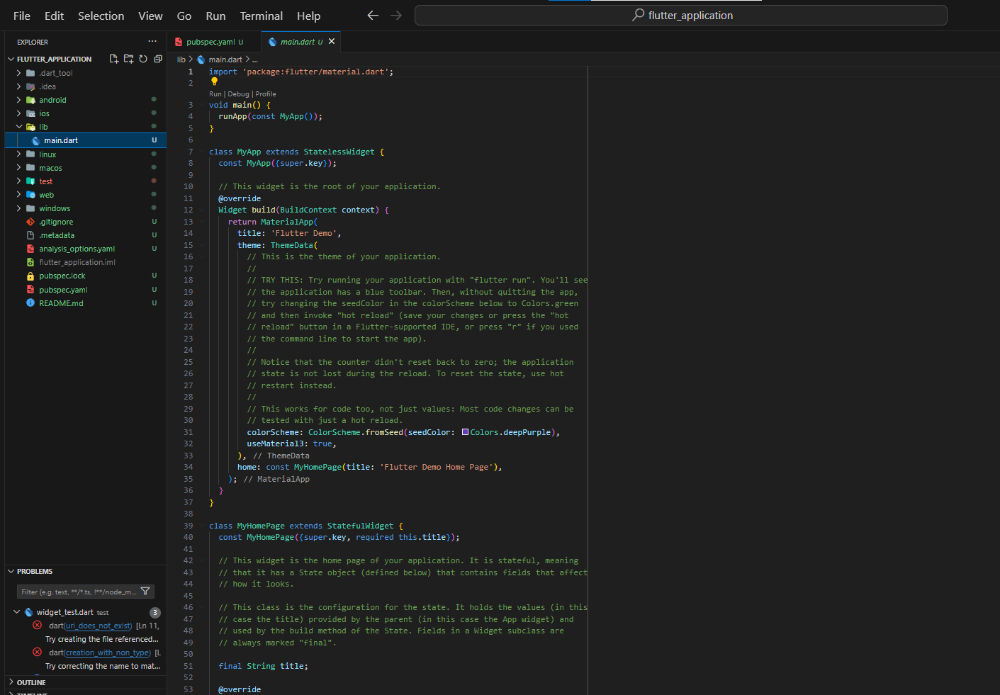
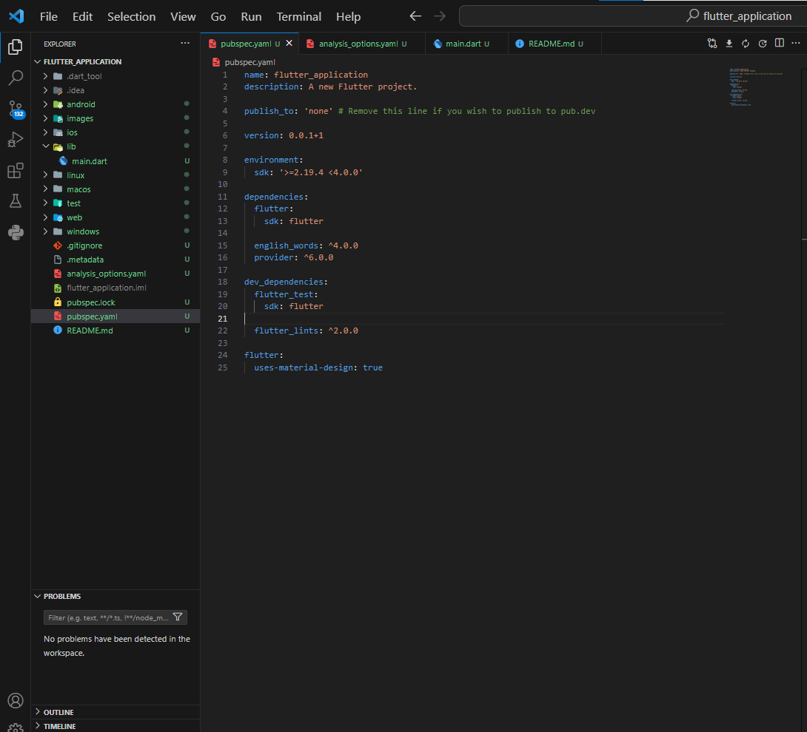
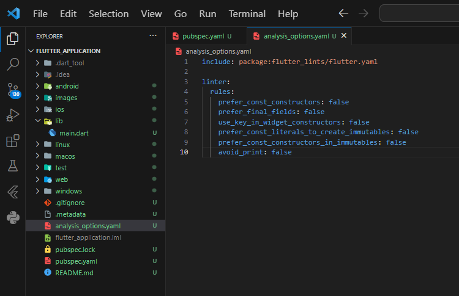
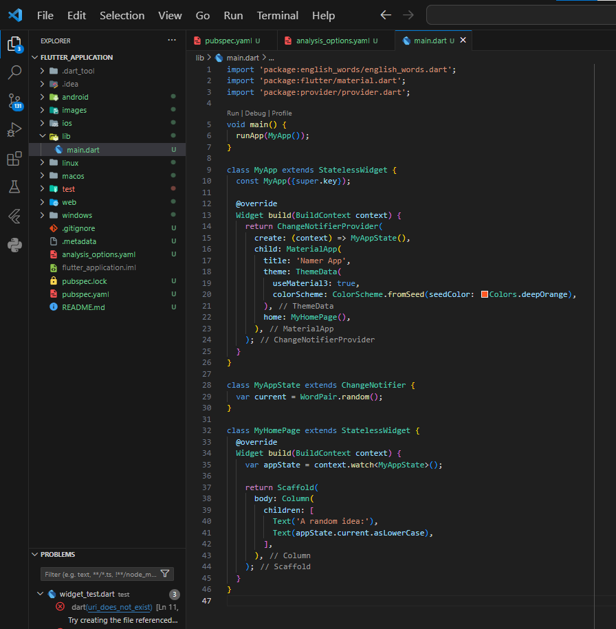
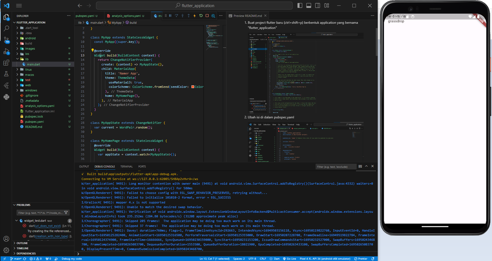
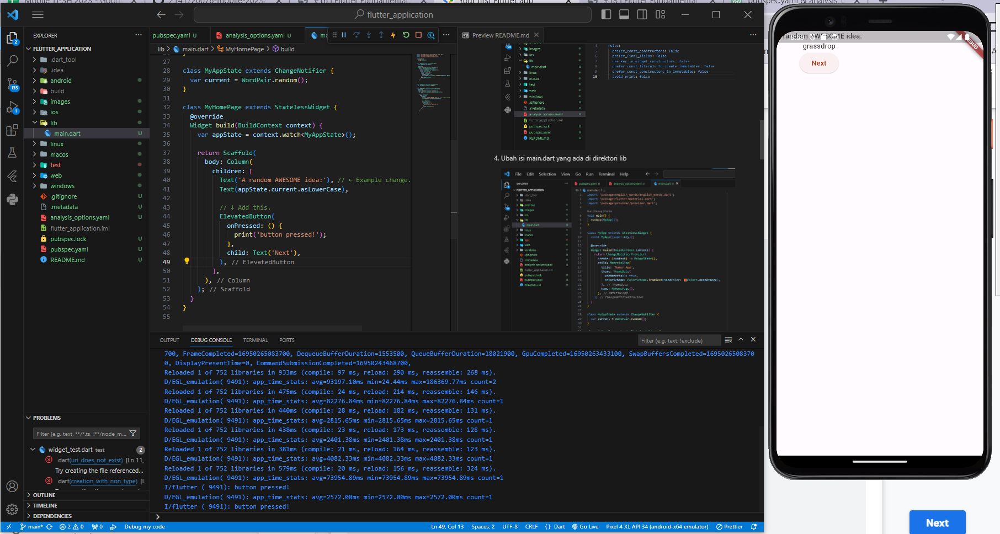

## Step by Step Your First Flutter App

### Muhammad Dzaka Murran Rusid | 2141720076 | TI-3H

### Langkah 1 | Buat proyek dengan nama "Flutter Application"

1. Buat project flutter baru (ctrl+shift+p) berbentuk application yang bernama "flutter_application"

    

2. Ubah isi di dalam pubspec.yaml
 
    

3. Ubah isi analysis_options.yaml

    

4. Ubah isi main.dart yang ada di direktori lib

    

### Penjelasan: 

Di langkah awal ini, saya akan membuat project flutter dengan nama "flutter_application". Setelah dibuat, akan dilakukan beberapa konfigurasi khususnya di bagian pubspec.yaml dan analysis_option.yaml. 

- pubspec.yaml adalah berkas konfigurasi yang digunakan untuk mengelola dependensi dan pengaturan proyek Dart Anda. Dalamnya, Anda daftar paket yang diperlukan untuk proyek Anda dan pengaturan dasar seperti nama dan versi proyek. 
- analysis_option.yaml adalah berkas konfigurasi yang digunakan untuk mengatur aturan analisis kode sumber Anda dengan alat seperti Dart Analyzer. Dalamnya, Anda tetapkan aturan dan preferensi untuk memeriksa dan memastikan kualitas kode Anda sesuai dengan standar tertentu.

Kemudian, konfigurasi pubspec dan analysis_option dari codelab akan disalin dan ditempel di proyek kita, setelah itu mengubah main dart-nya dengan membuat tiga widget utama berbentuk stateless yaitu MyApp, MyAppState, dan MyHomePage. Ketiganya berisikan widget-widget yang memiliki berbagai fungsi, mulai dari pengembalian widget lainnya, pustaka user interface, dan lain sebagainya. 

### Langkah 2 | Tambahkan tombol

1. Jalankan Aplikasinya

    

2. Hot Reload Pertama

    

3. Tambahkan tombol 

    

4. 