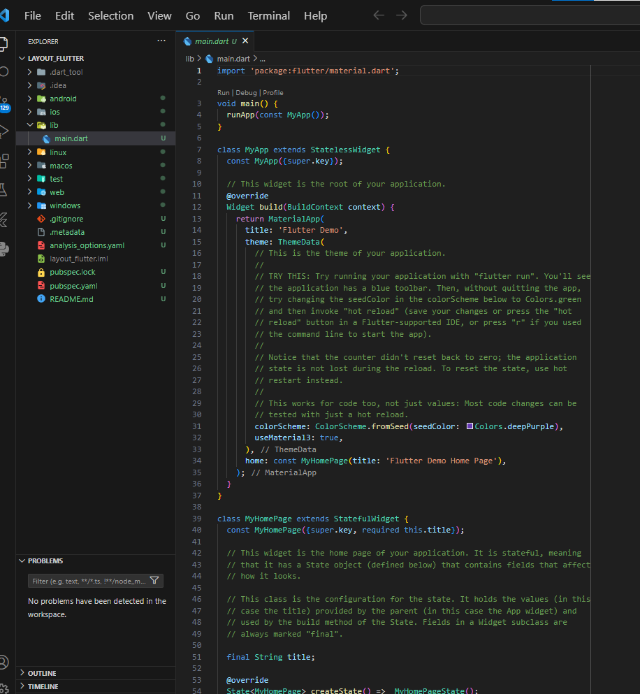
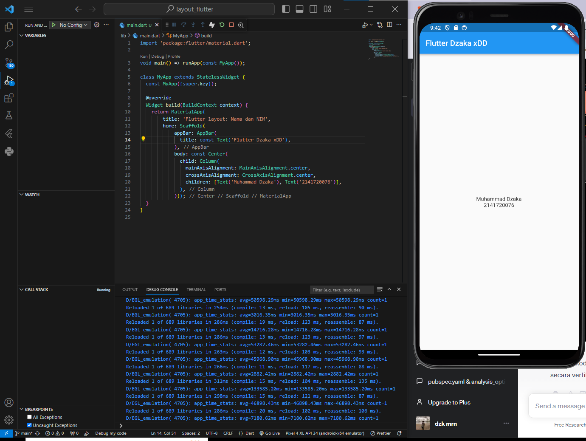
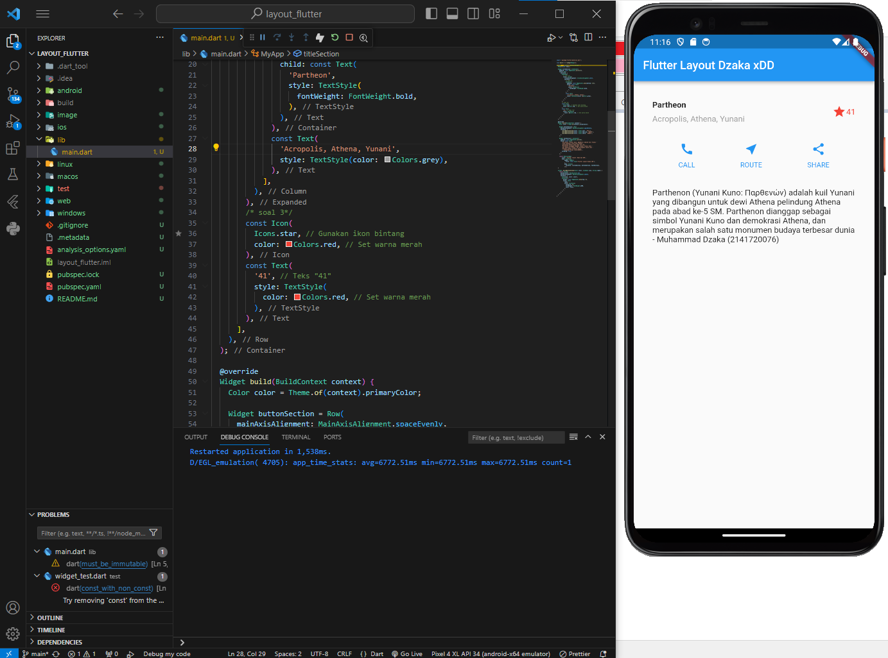
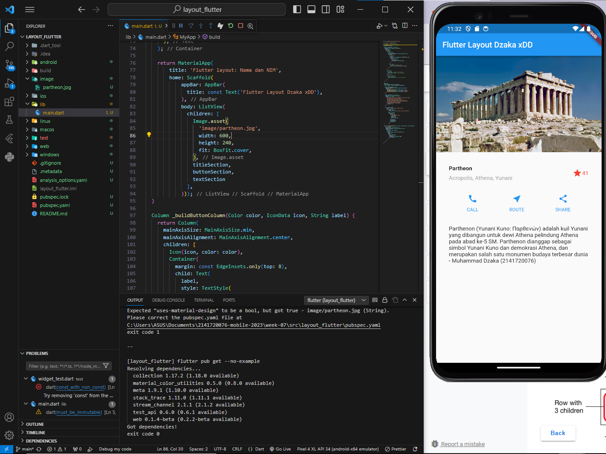

# Week 07 - Flutter: Layout dan Navigation

Di minggu ketujuh ini, mahasiswa akan mempelajari dasar-dasar dalam layouting di flutter dengan meingimplementasikan row-column, text section, dsb.

## Penulis

>> [@dzkmrn](https://www.github.com/dzkmrn)

## Tugas Praktikum

### Praktikum 1: Membangun Layout di Flutter

1. Buat Project Baru, Buatlah sebuah project flutter baru dengan nama layout_flutter. Atau sesuaikan style laporan praktikum yang Anda buat.

    

2. Buka file lib/main.dart, Buka file main.dart lalu ganti dengan kode berikut. Isi nama dan NIM Anda di text title.

    ```dart
    import 'package:flutter/material.dart';

    void main() => runApp(const MyApp());

    class MyApp extends StatelessWidget {
    const MyApp({super.key});

    @override
    Widget build(BuildContext context) {
        return MaterialApp(
            title: 'Flutter layout: Nama dan NIM',
            home: Scaffold(
                appBar: AppBar(
                title: const Text('Flutter Dzaka xDD'),
                ),
                body: const Center(
                child: Column(
                    mainAxisAlignment: MainAxisAlignment.center,
                    crossAxisAlignment: CrossAxisAlignment.center,
                    children: [Text('Muhammad Dzaka'), Text('2141720076')],
                ),
                )));
    }
    }
    ```

    **OUTPUT:**
    
    


3. Identifikasi layout diagram, Langkah pertama adalah memecah tata letak menjadi elemen dasarnya:

    - Identifikasi baris dan kolom.
    - Apakah tata letaknya menyertakan kisi-kisi (grid)?
    - Apakah ada elemen yang tumpang tindih?
    - Apakah UI memerlukan tab?
    - Perhatikan area yang memerlukan alignment, padding,  atau borders.
    
    Setelah dilakukan identifikasi selama 1 menit, aplikasi ini memliki tata letak sebagai berikut: Ada empat baris utama yang setiap baris berisikan gambar, kolom title, kolom button, dan kolom text. Setiap kolom berisikan widget2 yang disususn sedemikian rupa menjadi satu tampilan utuh tersebut. 

4. Implementasi title row, Pertama, Anda akan membuat kolom bagian kiri pada judul. Tambahkan kode berikut di bagian atas metode build() di dalam kelas MyApp:

    **Screenshot File Project:** 
    

### Praktikum 2: Implementasi button row

1. Buat method Column _buildButtonColumn

    ```dart 
    class MyApp extends StatelessWidget {
    const MyApp({super.key});

    @override
    Widget build(BuildContext context) {
        // ···
    }

    Column _buildButtonColumn(Color color, IconData icon, String label) {
        return Column(
        mainAxisSize: MainAxisSize.min,
        mainAxisAlignment: MainAxisAlignment.center,
        children: [
            Icon(icon, color: color),
            Container(
            margin: const EdgeInsets.only(top: 8),
            child: Text(
                label,
                style: TextStyle(
                fontSize: 12,
                fontWeight: FontWeight.w400,
                color: color,
                ),
            ),
            ),
        ],
        );
    }
    }
    ```
2. Buat widget buttonSection

    ```dart
    Color color = Theme.of(context).primaryColor;

    Widget buttonSection = Row(
    mainAxisAlignment: MainAxisAlignment.spaceEvenly,
    children: [
        _buildButtonColumn(color, Icons.call, 'CALL'),
        _buildButtonColumn(color, Icons.near_me, 'ROUTE'),
        _buildButtonColumn(color, Icons.share, 'SHARE'),
    ],
    );
    ```
3. Tambah button section ke body

    ```dart
    return MaterialApp(
    title: 'Flutter layout: Nama dan NIM',
    home: Scaffold(
    appBar: AppBar(
    title: const Text('Flutter Layout Dzaka xDD'),
    ),
    body: Column(
        children: [titleSection, buttonSection],
    )));
    ```

### Praktikum 3: Implementasi text section
1. Buat widget textSection, Tentukan bagian teks sebagai variabel. Masukkan teks ke dalam Container dan tambahkan padding di sepanjang setiap tepinya. Tambahkan kode berikut tepat di bawah deklarasi buttonSection:

    ```dart
    Widget textSection = Container(
      padding: const EdgeInsets.all(32),
      child: const Text(
        'Parthenon (Yunani Kuno: Παρθενών) adalah kuil Yunani '
        'yang dibangun untuk dewi Athena '
        'pelindung Athena pada abad ke-5 SM. '
        'Parthenon dianggap sebagai simbol Yunani Kuno '
        'dan demokrasi Athena, dan merupakan salah satu '
        'monumen budaya terbesar dunia '
        ' - Muhammad Dzaka (2141720076)',
        softWrap: true,
      ),
    );
    ```

2. Tambahkan variabel text section ke body, Tambahkan widget variabel textSection ke dalam body seperti berikut:


    ```dart 
    body: Column(
    children: [titleSection, buttonSection, textSection],
    )));
    ```
    **OUTPUT:**
    
    


3. Liat hasilnya

    **OUTPUT:**
    


### Praktikum 4: Implementasi image section

1. Anda dapat mencari gambar di internet yang ingin ditampilkan. Buatlah folder images di root project layout_flutter. Masukkan file gambar tersebut ke folder images, lalu set nama file tersebut ke file pubspec.yaml seperti berikut:

    ```dart
    # The following section is specific to Flutter packages.
        flutter:

        uses-material-design: true
            - images/partheon.jpg
    ```
    **OUTPUT:**
    
    

2. Tambahkan gambar ke body, Tambahkan aset gambar ke dalam body seperti berikut:

    ```dart
        return MaterialApp(
        title: 'Flutter layout: Nama dan NIM',
        home: Scaffold(
            appBar: AppBar(
              title: const Text('Flutter Layout Dzaka xDD'),
            ),
            body: Column(
              children: [
                Image.asset(
                  'images/partheon.jpg',
                  width: 600,
                  height: 240,
                ),
                buttonSection,
                textSection
              ],
            )));
    ```

    BoxFit.cover memberi tahu kerangka kerja bahwa gambar harus sekecil mungkin tetapi menutupi seluruh kotak rendernya.

3. Terakhir, ubah menjadi ListView, Pada langkah terakhir ini, atur semua elemen dalam ListView, bukan Column, karena ListView mendukung scroll yang dinamis saat aplikasi dijalankan pada perangkat yang resolusinya lebih kecil.

    ```dart
    return MaterialApp(
    title: 'Flutter layout: Nama dan NIM',
    home: Scaffold(
        appBar: AppBar(
            title: const Text('Flutter Layout Dzaka xDD'),
        ),
        body: ListView(
            children: [
            Image.asset(
                'image/partheon.jpg',
                width: 600,
                height: 240,
                fit: BoxFit.cover,
            ),
            titleSection,
            buttonSection,
            textSection
        ],
    )));
    ```

### Tugas Praktikum

1. Selesaikan Praktikum 1 sampai 4, lalu dokumentasikan dan push ke repository Anda berupa screenshot setiap hasil pekerjaan beserta penjelasannya di file README.md!

    ### Before and after

    #### Before

    

    #### After

    


2. Silakan implementasikan di project baru "basic_layout_flutter" dengan mengakses sumber ini: https://docs.flutter.dev/codelabs/layout-basics  

    **Jawaban:**

    Silahkan klik disini pakk untuk melihat project-nyaa

3. Kumpulkan link commit repository GitHub Anda ke spreadsheet yang telah disediakan!

    **Jawaban:**
    Sudah di push pakk ^^


