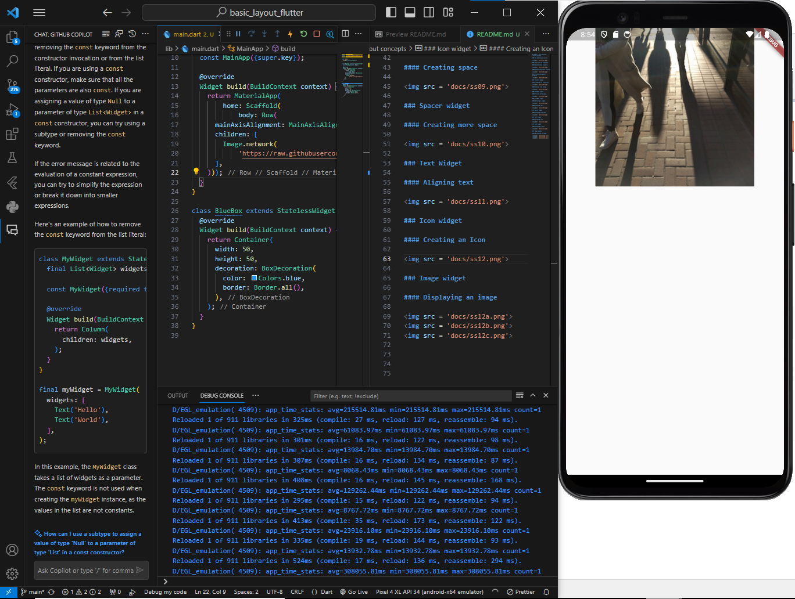

## Tugas | Basic Flutter layout concepts

### Row and Column classes

### Axis Size and alignment

#### mainAxisSize property

#### mainAxisAlignment property

#### crossAxisAlignment property

### Flexible widget

#### Changing fit properties

#### Testing flex values

### Expanded widget

#### Filling extra space

### SizedBox widget

#### Resizing a widget

#### Creating space

### Spacer widget

#### Creating more space

### Text Widget

#### Aligning text

### Icon widget

#### Creating an Icon

### Image widget

#### Displaying an image

pic1

pic2

pic3

### Putting it all together

### Part 1

#### 1. Create the name and title

#### 2. Wrap the Column in a Row

### Part 2

#### Tweak the layout

### Enter Contact Information

### Part 3

#### Add four icons

