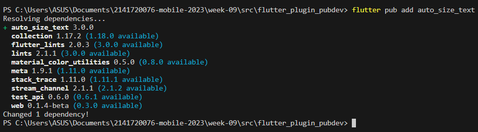
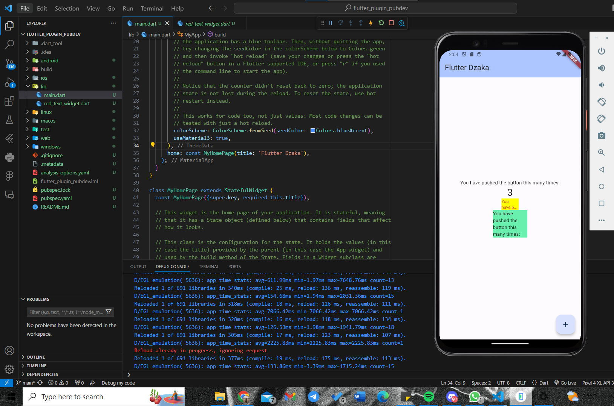

# Week 10 - Flutter: Manajemen Plugin

Di minggu kedelapan ini, mahasiswa akan mempelajari perpindahan halaman di Flutter menggunakan navigasi dan rute dengan konsep stack.  

## Penulis

>> [@dzkmrn](https://www.github.com/dzkmrn)

### Praktikum | Manajemen Plugin di Flutter

#### Langkah 1: Siapkan project baru
Buatlah sebuah project flutter baru dengan nama flutter_plugin_pubdev. Lalu jadikan repository di GitHub Anda dengan nama flutter_plugin_pubdev.

#### Langkah 2: Menambahkan Plugin
Tambahkan plugin auto_size_text menggunakan perintah berikut di terminal

```dart
flutter pub add auto_size_text
```



#### Langkah 3: Lengkapi Kode di main.dart
Buat file baru bernama red_text_widget.dart di dalam folder lib lalu isi kode seperti berikut.

```dart
import 'package:flutter/material.dart';

class RedTextWidget extends StatelessWidget {
  const RedTextWidget({Key? key}) : super(key: key);

  @override
  Widget build(BuildContext context) {
    return Container();
  }
}
```

#### Langkah 4: Tambah Widget AutoSizeText
Masih di file red_text_widget.dart, untuk menggunakan plugin auto_size_text, ubahlah kode return Container() menjadi seperti berikut.

```dart
return AutoSizeText(
      text,
      style: const TextStyle(color: Colors.red, fontSize: 14),
      maxLines: 2,
      overflow: TextOverflow.ellipsis,
);
```

Setelah Anda menambahkan kode di atas, Anda akan mendapatkan info error. Mengapa demikian? Jelaskan dalam laporan praktikum Anda!

**Jawaban: Terjadi error sebagai berikut:**

```
The method 'AutoSizeText' isn't defined for the type 'RedTextWidget'.
Try correcting the name to the name of an existing method, or defining a method named 'AutoSizeText'.dartundefined_method
```

**Hal tersebut dikarenakan package atau dependencies yang telah di-add sebelumnya belum di-import ke red_text_widget**

```dart
import 'package:auto_size_text/auto_size_text.dart';
```

#### Langkah 5: Buat Variabel text dan parameter di constructor
Tambahkan variabel text dan parameter di constructor seperti berikut.

```dart
final String text;

const RedTextWidget({Key? key, required this.text}) : super(key: key);  
```

#### Langkah 6: Tambahkan widget di main.dart
Buka file main.dart lalu tambahkan di dalam children: pada class _MyHomePageState

```dart
Container(
   color: Colors.yellowAccent,
   width: 50,
   child: const RedTextWidget(
             text: 'You have pushed the button this many times:',
          ),
),
Container(
    color: Colors.greenAccent,
    width: 100,
    child: const Text(
           'You have pushed the button this many times:',
          ),
),
```

Run aplikasi tersebut dengan tekan F5, maka hasilnya akan seperti berikut.



### 8. Tugas Praktikum
1. Selesaikan Praktikum tersebut, lalu dokumentasikan dan push ke repository Anda berupa screenshot hasil pekerjaan beserta penjelasannya di file README.md!

>> Jawaban: Sudah dilakukan.

2. Jelaskan maksud dari langkah 2 pada praktikum tersebut!

>> Jawaban: pada langkah dua, "flutter pub add auto_size_text" digunakan untuk mengunduh packages "auto_size_text" yang tersedia di pub_dev, dengan cara menempatkannya pada pubspec.yaml, tepatnya pada dependecies>flutter. 

3. Jelaskan maksud dari langkah 5 pada praktikum tersebut!

>> Jawaban: Pada langkah 5 tersebut, kita membuat variabel tipe String bernama "text", variabel tersebut digunakan untuk menyimpan nilai string yang akan menjadi parameter value pada constructor RedTextWidget(). Sehingga, ketika memakai RedTextWidget() di main.dart, bisa di-passing text yang ingin dipengaruhi RedTextWidget().

4. Pada langkah 6 terdapat dua widget yang ditambahkan, jelaskan fungsi dan perbedaannya!

>> Jawaban: Dua widget tersebut ditambahkan ke halaman utama untuk menampilkan dua container yang berisikan text dengan color dan width yang berbeda. Fungsi RedTextWidget() disini adalah untuk menyesuaikan widget text dengan ukuran width yang diberikan pada setiap container. Dengan RedTextWidget(), container pertama memiliki text dengan ukuran width 50, text kedua dengan ukuran width 100. 

Container(
   color: Colors.yellowAccent,
   width: 50,
   child: const RedTextWidget(
             text: 'You have pushed the button this many times:',
          ),
),
Container(
    color: Colors.greenAccent,
    width: 100,
    child: const Text(
           'You have pushed the button this many times:',
          ),
),


5. Jelaskan maksud dari tiap parameter yang ada di dalam plugin auto_size_text berdasarkan tautan pada dokumentasi [ini](https://pub.dev/documentation/auto_size_text/latest/) !

>> Jawaban: 

    1. key: Parameter ini mengontrol bagaimana satu widget menggantikan widget lain dalam pohon.

    2. textKey: Digunakan untuk mengatur kunci yang terkait dengan widget Teks yang dihasilkan.

    3. style: Jika tidak null, parameter ini menentukan gaya yang akan diterapkan pada teks.

    4. minFontSize: Parameter ini mengatur batasan ukuran minimum teks yang akan diterapkan saat menyesuaikan ukuran teks secara otomatis, kecuali jika presetFontSizes diatur.

    5. maxFontSize: Parameter ini menentukan batasan ukuran maksimum teks yang digunakan saat menyesuaikan ukuran teks secara otomatis, kecuali jika presetFontSizes diatur.

    6. stepGranularity: Menentukan ukuran langkah di mana ukuran font disesuaikan dengan batasan.

    7. presetFontSizes: Predefines semua ukuran font yang mungkin, dengan catatan bahwa harus dalam urutan menurun.

    8. group: Parameter ini sinkronisasi ukuran beberapa AutoSizeTexts.

    9. textAlign: Cara teks harus diatur secara horizontal.

    10. textDirection: Parameter ini menentukan arah teks, yang memengaruhi cara nilai-nilai textAlign seperti TextAlign.start dan TextAlign.end diinterpretasikan.

    11. locale: Digunakan untuk memilih font ketika karakter Unicode yang sama dapat dirender secara berbeda berdasarkan bahasa dan budaya.

    12. softWrap: Menentukan apakah teks harus mematahkan baris secara lembut.

    13. wrapWords: Menentukan apakah kata-kata yang tidak muat dalam satu baris harus dibungkus.

    14. overflow: Menentukan cara overflow visual harus diatasi.

    15. overflowReplacement: Jika teks melampaui batasnya dan tidak muat, widget ini ditampilkan sebagai penggantinya.

    16. textScaleFactor: Menentukan jumlah piksel font untuk setiap piksel logis. Juga memengaruhi minFontSize, maxFontSize, dan presetFontSizes.

    17. maxLines: Jumlah maksimum baris opsional yang bisa ditampilkan oleh teks.

    18. semanticsLabel: Memberikan label semantik alternatif untuk teks ini.


6.Kumpulkan laporan praktikum Anda berupa link repository GitHub ke spreadsheet yang telah disediakan!

>> Jawaban: Sudah Pakk ^^=
