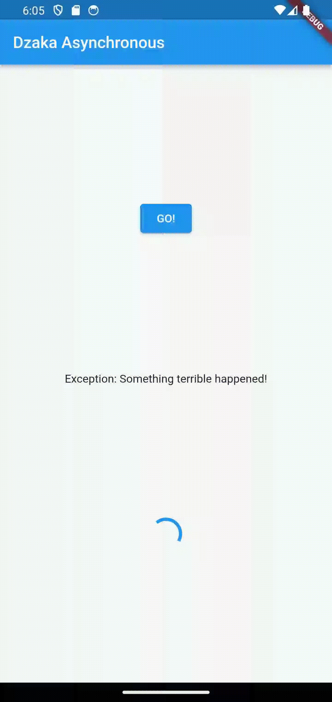
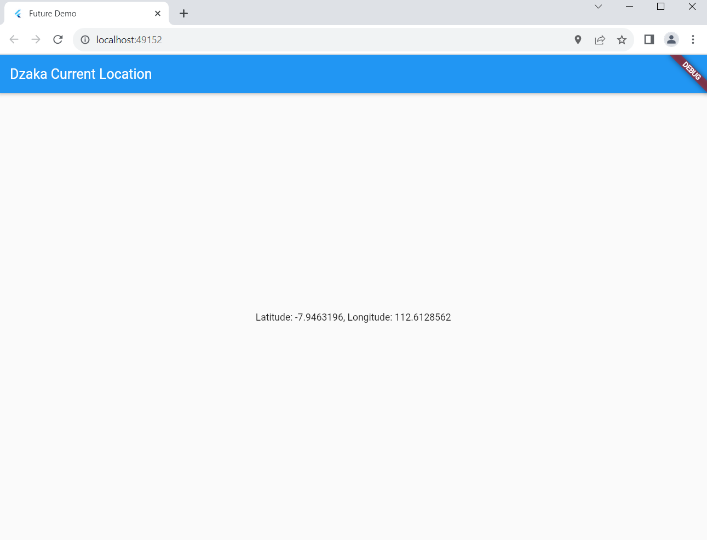

# Week 12 - Pemrograman Asynchronous

Di minggu dua belas ini, mahasiswa akan mempelajari pemrograman asynchronous dan pembuatan projek flutter books menggunakan konsep asynchronous.  

## Penulis

>> [@dzkmrn](https://www.github.com/dzkmrn)

## Praktikum 1: Mengunduh Data dari Web Service (API)


#### Langkah 1: Siapkan project baru
Buatlah sebuah project flutter baru dengan nama books di folder src week-12 repository GitHub Anda.

Kemudian Tambahkan dependensi http dengan mengetik perintah berikut di terminal. 

```dart 
flutter pub add http
```

#### Langkah 2: Cek file pubspec.yaml
Jika berhasil install plugin, pastikan plugin http telah ada di file pubspec ini seperti berikut.


#### Langkah 3: Buka file main.dart
Kita juga perlu sebuah List untuk menyimpan daftar rencana dalam aplikasi to-do ini. Buat file plan.dart di dalam folder models dan isi kode seperti berikut.

```dart
import 'dart:async';
import 'package:flutter/material.dart';
import 'package:http/http.dart';
import 'package:http/http.dart' as http;

void main() {
  runApp(const MyApp());
}

class MyApp extends StatelessWidget {
  const MyApp({super.key});

  @override
  Widget build(BuildContext context) {
    return MaterialApp(
      title: 'Future Demo',
      theme: ThemeData(
          primarySwatch: Colors.blue,
          visualDensity: VisualDensity.adaptivePlatformDensity),
      home: const FuturePage(),
    );
  }
}

class FuturePage extends StatefulWidget {
  const FuturePage({super.key});

  @override
  State<FuturePage> createState() => _FuturePageState();
}

class _FuturePageState extends State<FuturePage> {
  String result = '';
  @override
  Widget build(BuildContext context) {
    return Scaffold(
      appBar: AppBar(
        title: const Text('Back from the Future'),
      ),
      body: Center(
        child: Column(
          children: [
            const Spacer(),
            ElevatedButton(
              child: const Text('GO!'),
              onPressed: () {},
            ),
            const Spacer(),
            Text(result),
            const Spacer(),
            const CircularProgressIndicator(),
            const Spacer(),
          ],
        ),
      ),
    );
  }
}
```

### Soal 1
Tambahkan nama panggilan Anda pada title app sebagai identitas hasil pekerjaan Anda.


#### Langkah 4: Tambah method getData()
Tambahkan method ini ke dalam class _FuturePageState yang berguna untuk mengambil data dari API Google Books.

```dart
  Future<Response> getData() async {
    const authority = 'www.googleapis.com';
    const path = '/books/v1/volumes/FzVjBgAAQBAJ';
    Uri url = Uri.https(authority, path);
    return http.get(url);
  }
```

### Soal 2
- Carilah judul buku favorit Anda di Google Books, lalu ganti ID buku pada variabel path di kode tersebut. Caranya ambil di URL browser Anda seperti gambar berikut ini.

  

- Kemudian cobalah akses di browser URI tersebut dengan lengkap seperti ini. Jika menampilkan data JSON, maka Anda telah berhasil. Lakukan capture milik Anda dan tulis di README pada laporan praktikum. Lalu lakukan commit dengan pesan "W12: Soal 2".

  

#### Langkah 5: Tambah kode di ElevatedButton
Tambahkan kode pada onPressed di ElevatedButton seperti berikut.

```dart
ElevatedButton(
              child: const Text('GO!'),
              onPressed: () {
                setState(() {});
                getData().then((value) {
                  result = value.body.toString().substring(0, 450);
                  setState(() {});
                }).catchError((_) {
                  result = 'An error has occured!';
                  setState(() {});
                });
              },
            ),
```
Lakukan run aplikasi Flutter Anda. Anda akan melihat tampilan akhir seperti gambar berikut. Jika masih terdapat error, silakan diperbaiki hingga bisa running.

### Soal 3
- Jelaskan maksud kode langkah 5 tersebut terkait substring dan catchError!

  >> Jawaban: Dalam potongan kode tersebut ada: 

  >> substring(0, 450):
  Pada baris ini, metode substring digunakan untuk mengambil sebagian dari string. Dalam kasus ini, substring(0, 450) mengambil bagian dari string mulai dari indeks 0 hingga indeks 449 (450 karakter pertama). Jadi, variabel result akan berisi substring dari hasil respons yang diterima dari metode getData(). Misalnya, jika responsnya adalah sebuah teks, potongan ini akan membatasi teks tersebut hanya menjadi 450 karakter pertama.

  >> catchError():
  Metode ini digunakan dalam pemanggilan getData().then(...) untuk menangani kesalahan yang mungkin terjadi saat mengambil data. Jika terjadi kesalahan selama proses pengambilan data, blok catchError akan dieksekusi. Dalam contoh ini, jika ada kesalahan, result akan diatur ke string 'An error has occurred!', dan kemudian fungsi setState akan dipanggil untuk memperbarui tampilan UI dengan pesan kesalahan.

- Capture hasil praktikum Anda berupa GIF dan lampirkan di README. Lalu lakukan commit dengan pesan "W12: Soal 3".

  OUTPUT: 

  

--- 


## Praktikum 2: Menggunakan await/async untuk menghindari callbacks

#### Langkah 1: Buka file main.dart
Tambahkan tiga method berisi kode seperti berikut di dalam class _FuturePageState.

```dart
Future<int> returnOneAsync() async {
  await Future.delayed(const Duration(seconds: 3));
  return 1;
}

Future<int> returnTwoAsync() async {
  await Future.delayed(const Duration(seconds: 3));
  return 2;
}

Future<int> returnThreeAsync() async {
  await Future.delayed(const Duration(seconds: 3));
  return 3;
}
```

#### Langkah 2: Tambah method count()
Lalu tambahkan lagi method ini di bawah ketiga method sebelumnya.

```dart
  Future count() async {
    int total = 0;
    total = await returnOneAsync();
    total += await returnTwoAsync();
    total += await returnThreeAsync();
    setState(() {
      result = total.toString();
    });
  }
```

#### Langkah 3: Pangil count()
Lakukan comment kode sebelumnya, ubah isi kode onPressed() menjadi seperti berikut.

```dart
  onPressed: () {
   count(); //tambahhkan metod count() pada onPressed
```

### Langkah 4: Run
Akhirnya, run atau tekan F5 jika aplikasi belum running. Maka Anda akan melihat seperti gambar berikut, hasil angka 6 akan tampil setelah delay 9 detik.

### Soal 4
- Jelaskan maksud kode langkah 1 dan 2 tersebut!

  >> Jawaban: Langkah satu merupakan implementasi pemrograman asynchronous dengan mencoba membuat 3 method yang memiliki return 1, 2, dan 3 dengan durasi return-nya 3 detik (total 9 dtk) menggunakan Future.delayed. Kemudian di langkah ketiga, dibuat method count() yang akan mengumpulkan tiga method returnAsync tersebut. Sehingga ketika program dijalankan, muncul angka 6 di detik ke-9 setelah method jalan. 


- Capture hasil praktikum Anda berupa GIF dan lampirkan di README. Lalu lakukan commit dengan pesan "W12: Soal 4". 

  

## Praktikum 3: Menggunakan Completer di Future

#### Langkah 1: Buka main.dart
```dart
import 'package:async/async.dart';
```

#### Langkah 2: Tambahkan variabel dan method
Tambahkan variabel late dan method di class _FuturePageState seperti ini.

```dart
late Completer completer;

Future getNumber() {
  completer = Completer<int>();
  calculate();
  return completer.future;
}

Future calculate() async {
  await Future.delayed(const Duration(seconds : 5));
  completer.complete(42);
}
```

#### Langkah 3: Ganti isi kode onPressed()
Tambahkan kode berikut pada fungsi onPressed(). Kode sebelumnya bisa Anda comment.

```dart
getNumber().then((value){
  setState((){
    result = value.toString();
  });
});
```

#### Langkah 4:
Terakhir, run atau tekan F5 untuk melihat hasilnya jika memang belum running. Bisa juga lakukan hot restart jika aplikasi sudah running. Maka hasilnya akan seperti gambar berikut ini. Setelah 5 detik, maka angka 42 akan tampil.

### Soal 5
- Jelaskan maksud kode langkah 2 tersebut!

  >> Jawaban: Disitu diinisialisasikan variabel completer yang bertipe data late, dan dua method, yaitu getNumber() dan calculate(). Method getNumber() digunakan untuk menjalankan fungsi calculate() yang akan me-return completer.future. Method calculate akan menjalankan Future.delayed selama 5 detik untuk kemudian return complete(42) yang berarti pasti akan me-return kembali 42. 

- Capture hasil praktikum Anda berupa GIF dan lampirkan di README. Lalu lakukan commit dengan pesan "W12: Soal 5".

  >> Jawaban: Sudah.

  

  #### Langkah 6: Pindah ke onPressed()
Ganti menjadi kode seperti berikut.
```dart
getNumber().then((value){
  setState((){
    result = value.toString();
  }).catchError((e){
    result = 'An error occured';
  });
});
```

### Soal 6
- Jelaskan maksud perbedaan kode langkah 2 dengan langkah 5-6 tersebut!

  >>Jawaban: Perbedaannya ada pada penaruhan catchError() sebagai alternatif jika value-nya tidak sesuai (error) maka akan return "An errror Occured". Tetapi pada kasus ini tidak terjadi error sehingga output-nya sama

- Capture hasil praktikum Anda berupa GIF dan lampirkan di README. Lalu lakukan commit dengan pesan "W12: Soal 6".
  
  >>Jawaban:

  

## Praktikum 4: Memanggil Future secara paralel

#### Langkah 1: Buka file main.dart
Tambahkan method ini ke dalam class _FuturePageState
```dart
  void returnFG() {
    FutureGroup<int> futureGroup = FutureGroup<int>();
    futureGroup.add(returnOneAsync());
    futureGroup.add(returnTwoAsync());
    futureGroup.add(returnThreeAsync());
    futureGroup.close();
    futureGroup.future.then((List<int> value) {
      int total = 0;
      for (var element in value) {
        total += element;
      }
      setState(() {
        result = total.toString();
      });
    });
  }
```


#### Langkah 2: Edit onPressed()
Anda bisa hapus atau comment kode sebelumnya, kemudian panggil method dari langkah 1 tersebut.

```dart
onPressed: () {
  returnFG();
},
```
#### Langkah 3: Run
Anda akan melihat hasilnya dalam 3 detik berupa angka 6 lebih cepat dibandingkan praktikum sebelumnya menunggu sampai 9 detik.

### Soal 7
- Capture hasil praktikum Anda berupa GIF dan lampirkan di README. Lalu lakukan commit dengan pesan "W12: Soal 7".

  

#### Langkah 4: Ganti variabel futureGroup
Anda dapat menggunakan FutureGroup dengan Future.wait seperti kode berikut.

```dart
final futures = Future.wait<int>([
  returnOneAsync(),
  returnTwoAsync(),
  returnThreeAsync(),
]);
```

diubah menjadi berikut: 

```dart
  void returnFG() async {
    final futures = Future.wait<int>([
      returnOneAsync(),
      returnTwoAsync(),
      returnThreeAsync(),
    ]);

    try {
      List<int> values = await futures;

      int total = values.fold(0, (acc, element) => acc + element);

      setState(() {
        result = total.toString();
      });
    } catch (error) {
      // Handle errors if needed
      print("Error: $error");
    }
  }
```

### Soal 8
- Jelaskan maksud perbedaan kode langkah 1 dan 4!
  >> Jawaban: Perbedaan kode langkah 1 dan 4 adalah efisiensi baris kodenya, fungsinya sama, tetapi dengan menggabungkannya di list final futures, kode yang ditulis akan lebih sedikit. 

## Praktikum 5: Menangani Respon Error pada Async Code

#### Langkah 1: Buka file main.dart
Tambahkan method ini ke dalam class _FuturePageState

```dart
  Future returnError() async {
    await Future.delayed(const Duration(seconds: 2));
    throw Exception('Something terrible happened!');
  }
```


#### Langkah 2: ElevatedButton
Ganti dengan kode berikut

```dart
            ElevatedButton(
                child: const Text('GO!'),
                onPressed: () {
                  returnError().then((value) {
                    setState(() {
                      result = 'Success!';
                    });
                  }).catchError((onError) {
                    setState(() {
                      result = onError.toString();
                    });
                  }).whenComplete(() => print('Completed'));
                }),
```

#### Langkah 3: Run
Lakukan run dan klik tombol GO! maka akan menghasilkan seperti gambar berikut.

### Soal 9
- Capture hasil praktikum Anda berupa GIF dan lampirkan di README. Lalu lakukan commit dengan pesan "W12: Soal 9".

  OUTPUT: 

  

#### Langkah 4: Tambah method handleError()
Tambahkan kode ini di dalam class _FutureStatePage

```dart
  Future handleError() async {
    try {
      await returnError();
    } catch (error) {
      setState(() {
        result = error.toString();
      });
    } finally {
      print('Complete');
    }
  }
```

### Soal 10
- Panggil method handleError() tersebut di ElevatedButton, lalu run. Apa hasilnya? Jelaskan perbedaan kode langkah 1 dan 4!

  OUTPUT: 
  
  

  >> Penjelasan: Hasilnya adalah throw exception atau output error yang muncul lebih cepat (sekitar 2 dtk). Karena ketika ketika terjadi error dari returnError() yang ditangkap dengan try and catch, akan me-result error lagi sehingga muncul error-nya lebih cepat. 

## Praktikum 6: Menggunakan Future dengan StatefulWidget

#### Langkah 1: install plugin geolocator
Tambahkan plugin geolocator dengan mengetik perintah berikut di terminal.

```
flutter pub add geolocator
```

#### Langkah 2: Tambah permission GPS
Jika Anda menargetkan untuk platform Android, maka tambahkan baris kode berikut di file android/app/src/main/androidmanifest.xml

#### Langkah 3: Buat file geolocation.dart
Tambahkan file baru ini di folder lib project Anda.

#### Langkah 4: Buat StatefulWidget
Buat class LocationScreen di dalam file geolocation.dart

#### Langkah 5: Isi kode geolocation.dart

### Soal 11
- Tambahkan nama panggilan Anda pada tiap properti title sebagai identitas pekerjaan Anda.

#### Langkah 6: Edit main.dart
Panggil screen baru tersebut di file main Anda seperti berikut.

#### Langkah 7: Run
Run project Anda di device atau emulator (bukan browser), maka akan tampil seperti berikut ini.

#### Langkah 8: Tambahkan animasi loading
Tambahkan widget loading seperti kode berikut. Lalu hot restart, perhatikan perubahannya

### Soal 12
- Jika Anda tidak melihat animasi loading tampil, kemungkinan itu berjalan sangat cepat. Tambahkan delay pada method getPosition() dengan kode await Future.delayed(const Duration(seconds: 3))

- Apakah Anda mendapatkan koordinat GPS ketika run di browser? Mengapa demikian?

  >>Jawaban: Karena package geolocator juga support di browser, sehingga koordinat GPS juga bisa didapatkan pada browser, beserta izinnya. 

  


- Capture hasil praktikum Anda berupa GIF dan lampirkan di README. Lalu lakukan commit dengan pesan "W12: Soal 12".

  >>Jawaban

  OUTPUT

  

## Praktikum 7: Manajemen Future dengan FutureBuilder

#### Langkah 1: Modifikasi method getPosition()
Buka file geolocation.dart kemudian ganti isi method dengan kode ini.

```dart
await Future.delayed(const Duration(seconds: 3));
```

#### Langkah 2: Tambah variabel
Tambah variabel ini di class _LocationScreenState

```dart
Future<Position>? position;
```

#### Langkah 3: Tambah initState()
Tambah method ini dan set variabel position

```dart
  @override
  void initState() {
    super.initState();
    position = getPosition();
  }
```

#### Langkah 4: Edit method build()
Ketik kode berikut dan sesuaikan. Kode lama bisa Anda comment atau hapus.

```dart
  @override
  Widget build(BuildContext context) {
    final myWidget =
        myPosition == '' ? const CircularProgressIndicator() : Text(myPosition);

    return Scaffold(
        appBar: AppBar(
          title: const Text('Dzaka Current Location'),
        ),
        body: Center(
          child: FutureBuilder(
            future: position,
            builder: (BuildContext context, AsyncSnapshot<Position> snapshot) {
              if (snapshot.connectionState == ConnectionState.waiting) {
                return const CircularProgressIndicator();
              } else if (snapshot.connectionState == ConnectionState.done) {
                return Text(snapshot.data.toString());
              } else {
                return const Text('');
              }
            },
          ),
        ));
  }
```

### Soal 13
- Apakah ada perbedaan UI dengan praktikum sebelumnya? Mengapa demikian?

  >> Jawaban: Tidak ada perbedaan, hal tersebut dikarenakan kita hanya mengumpulkan keseluruhan proses getlocation mulai dari izin hingga tampil gps location di FutureBuilder agar lebih efisien dan mudah untuk diubah-ubah dalam pengembangan ke depan. 

- Capture hasil praktikum Anda berupa GIF dan lampirkan di README. Lalu lakukan commit dengan pesan "W12: Soal 13".

  OUTPUT: 

  

Seperti yang Anda lihat, menggunakan FutureBuilder lebih efisien, clean, dan reactive dengan Future bersama UI.

#### Langkah 5: Tambah handling error
Tambahkan kode berikut untuk menangani ketika terjadi error. Kemudian hot restart.

```dart
else if (snapshot.connectionState == ConnectionState.done) {
  if (snapshot.hasError) {
     return Text('Something terrible happened!');
  }
  return Text(snapshot.data.toString());
}
```

### Soal 14
- Apakah ada perbedaan UI dengan langkah sebelumnya? Mengapa demikian?
  >> Jawaban: Tidak ada, karena baris kode tersebut hanya sebagai error handling yang akan me-return text tertulis apabila kondisi tersebut tidak terpenuhi (error). 

- Capture hasil praktikum Anda berupa GIF dan lampirkan di README. Lalu lakukan commit dengan pesan "W12: Soal 14".

  OUTPUT: 

  


