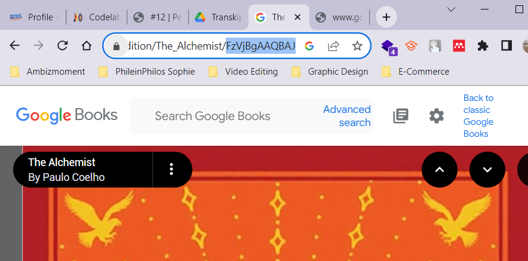

# Week 12 - Pemrograman Asynchronous

Di minggu dua belas ini, mahasiswa akan mempelajari pemrograman asynchronous dan pembuatan projek flutter books menggunakan konsep asynchronous.  

## Penulis

>> [@dzkmrn](https://www.github.com/dzkmrn)

## Praktikum 1: Mengunduh Data dari Web Service (API)


#### Langkah 1: Siapkan project baru
Buatlah sebuah project flutter baru dengan nama books di folder src week-12 repository GitHub Anda.

Kemudian Tambahkan dependensi http dengan mengetik perintah berikut di terminal. 

```dart 
flutter pub add http
```

#### Langkah 2: Cek file pubspec.yaml
Jika berhasil install plugin, pastikan plugin http telah ada di file pubspec ini seperti berikut.


#### Langkah 3: Buka file main.dart
Kita juga perlu sebuah List untuk menyimpan daftar rencana dalam aplikasi to-do ini. Buat file plan.dart di dalam folder models dan isi kode seperti berikut.

```dart
import 'dart:async';
import 'package:flutter/material.dart';
import 'package:http/http.dart';
import 'package:http/http.dart' as http;

void main() {
  runApp(const MyApp());
}

class MyApp extends StatelessWidget {
  const MyApp({super.key});

  @override
  Widget build(BuildContext context) {
    return MaterialApp(
      title: 'Future Demo',
      theme: ThemeData(
          primarySwatch: Colors.blue,
          visualDensity: VisualDensity.adaptivePlatformDensity),
      home: const FuturePage(),
    );
  }
}

class FuturePage extends StatefulWidget {
  const FuturePage({super.key});

  @override
  State<FuturePage> createState() => _FuturePageState();
}

class _FuturePageState extends State<FuturePage> {
  String result = '';
  @override
  Widget build(BuildContext context) {
    return Scaffold(
      appBar: AppBar(
        title: const Text('Back from the Future'),
      ),
      body: Center(
        child: Column(
          children: [
            const Spacer(),
            ElevatedButton(
              child: const Text('GO!'),
              onPressed: () {},
            ),
            const Spacer(),
            Text(result),
            const Spacer(),
            const CircularProgressIndicator(),
            const Spacer(),
          ],
        ),
      ),
    );
  }
}
```

### Soal 1
Tambahkan nama panggilan Anda pada title app sebagai identitas hasil pekerjaan Anda.


#### Langkah 4: Tambah method getData()
Tambahkan method ini ke dalam class _FuturePageState yang berguna untuk mengambil data dari API Google Books.

```dart
  Future<Response> getData() async {
    const authority = 'www.googleapis.com';
    const path = '/books/v1/volumes/FzVjBgAAQBAJ';
    Uri url = Uri.https(authority, path);
    return http.get(url);
  }
```

### Soal 2
- Carilah judul buku favorit Anda di Google Books, lalu ganti ID buku pada variabel path di kode tersebut. Caranya ambil di URL browser Anda seperti gambar berikut ini.

  

- Kemudian cobalah akses di browser URI tersebut dengan lengkap seperti ini. Jika menampilkan data JSON, maka Anda telah berhasil. Lakukan capture milik Anda dan tulis di README pada laporan praktikum. Lalu lakukan commit dengan pesan "W12: Soal 2".

  

#### Langkah 5: Tambah kode di ElevatedButton
Tambahkan kode pada onPressed di ElevatedButton seperti berikut.

```dart
ElevatedButton(
              child: const Text('GO!'),
              onPressed: () {
                setState(() {});
                getData().then((value) {
                  result = value.body.toString().substring(0, 450);
                  setState(() {});
                }).catchError((_) {
                  result = 'An error has occured!';
                  setState(() {});
                });
              },
            ),
```
Lakukan run aplikasi Flutter Anda. Anda akan melihat tampilan akhir seperti gambar berikut. Jika masih terdapat error, silakan diperbaiki hingga bisa running.

### Soal 3
- Jelaskan maksud kode langkah 5 tersebut terkait substring dan catchError!

  >> Jawaban: Dalam potongan kode tersebut ada: 

  >> substring(0, 450):
  Pada baris ini, metode substring digunakan untuk mengambil sebagian dari string. Dalam kasus ini, substring(0, 450) mengambil bagian dari string mulai dari indeks 0 hingga indeks 449 (450 karakter pertama). Jadi, variabel result akan berisi substring dari hasil respons yang diterima dari metode getData(). Misalnya, jika responsnya adalah sebuah teks, potongan ini akan membatasi teks tersebut hanya menjadi 450 karakter pertama.

  >> catchError():
  Metode ini digunakan dalam pemanggilan getData().then(...) untuk menangani kesalahan yang mungkin terjadi saat mengambil data. Jika terjadi kesalahan selama proses pengambilan data, blok catchError akan dieksekusi. Dalam contoh ini, jika ada kesalahan, result akan diatur ke string 'An error has occurred!', dan kemudian fungsi setState akan dipanggil untuk memperbarui tampilan UI dengan pesan kesalahan.

- Capture hasil praktikum Anda berupa GIF dan lampirkan di README. Lalu lakukan commit dengan pesan "W12: Soal 3".

  OUTPUT: 

  

--- 


## Praktikum 2: Menggunakan await/async untuk menghindari callbacks

#### Langkah 1: Buka file main.dart
Tambahkan tiga method berisi kode seperti berikut di dalam class _FuturePageState.

```dart
Future<int> returnOneAsync() async {
  await Future.delayed(const Duration(seconds: 3));
  return 1;
}

Future<int> returnTwoAsync() async {
  await Future.delayed(const Duration(seconds: 3));
  return 2;
}

Future<int> returnThreeAsync() async {
  await Future.delayed(const Duration(seconds: 3));
  return 3;
}
```

#### Langkah 2: Tambah method count()
Lalu tambahkan lagi method ini di bawah ketiga method sebelumnya.

```dart
  Future count() async {
    int total = 0;
    total = await returnOneAsync();
    total += await returnTwoAsync();
    total += await returnThreeAsync();
    setState(() {
      result = total.toString();
    });
  }
```

#### Langkah 3: Pangil count()
Lakukan comment kode sebelumnya, ubah isi kode onPressed() menjadi seperti berikut.

```dart
  onPressed: () {
   count(); //tambahhkan metod count() pada onPressed
```

### Langkah 4: Run
Akhirnya, run atau tekan F5 jika aplikasi belum running. Maka Anda akan melihat seperti gambar berikut, hasil angka 6 akan tampil setelah delay 9 detik.

### Soal 4
- Jelaskan maksud kode langkah 1 dan 2 tersebut!

  >> Jawaban: Langkah satu merupakan implementasi pemrograman asynchronous dengan mencoba membuat 3 method yang memiliki return 1, 2, dan 3 dengan durasi return-nya 3 detik (total 9 dtk) menggunakan Future.delayed. Kemudian di langkah ketiga, dibuat method count() yang akan mengumpulkan tiga method returnAsync tersebut. Sehingga ketika program dijalankan, muncul angka 6 di detik ke-9 setelah method jalan. 


- Capture hasil praktikum Anda berupa GIF dan lampirkan di README. Lalu lakukan commit dengan pesan "W12: Soal 4". 

  

## Praktikum 3: Menggunakan Completer di Future

#### Langkah 1: Buka main.dart
```dart
import 'package:async/async.dart';
```

#### Langkah 2: Tambahkan variabel dan method
Tambahkan variabel late dan method di class _FuturePageState seperti ini.

```dart
late Completer completer;

Future getNumber() {
  completer = Completer<int>();
  calculate();
  return completer.future;
}

Future calculate() async {
  await Future.delayed(const Duration(seconds : 5));
  completer.complete(42);
}
```

#### Langkah 3: Ganti isi kode onPressed()
Tambahkan kode berikut pada fungsi onPressed(). Kode sebelumnya bisa Anda comment.

```dart
getNumber().then((value){
  setState((){
    result = value.toString();
  });
});
```

#### Langkah 4:
Terakhir, run atau tekan F5 untuk melihat hasilnya jika memang belum running. Bisa juga lakukan hot restart jika aplikasi sudah running. Maka hasilnya akan seperti gambar berikut ini. Setelah 5 detik, maka angka 42 akan tampil.

### Soal 5
- Jelaskan maksud kode langkah 2 tersebut!

  >> Jawaban: Disitu diinisialisasikan variabel completer yang bertipe data late, dan dua method, yaitu getNumber() dan calculate(). Method getNumber() digunakan untuk menjalankan fungsi calculate() yang akan me-return completer.future. Method calculate akan menjalankan Future.delayed selama 5 detik untuk kemudian return complete(42) yang berarti pasti akan me-return kembali 42. 

- Capture hasil praktikum Anda berupa GIF dan lampirkan di README. Lalu lakukan commit dengan pesan "W12: Soal 5".

  >> Jawaban: Sudah.

  


