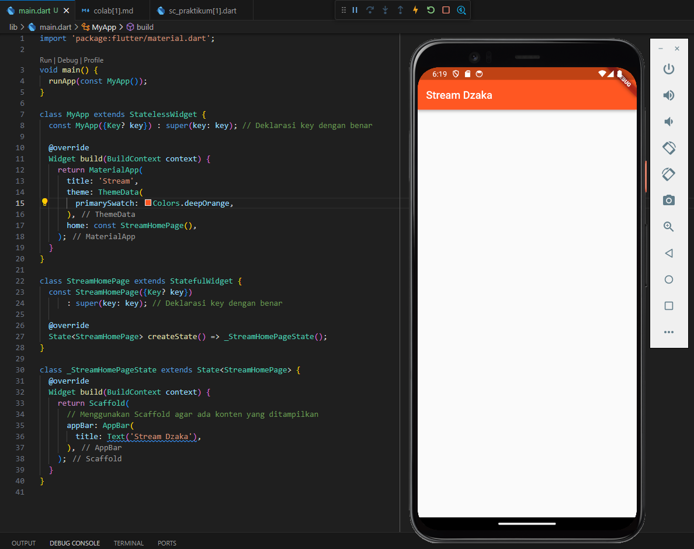

# Week 13 - Pemrograman Asynchronous

Di minggu dua belas ini, mahasiswa akan mempelajari pemrograman asynchronous dan pembuatan projek flutter books menggunakan konsep asynchronous.  

## Penulis

>> [@dzkmrn](https://www.github.com/dzkmrn)

## Praktikum 1: Dart Streams

#### Langkah 1: Siapkan project baru
Buatlah sebuah project flutter baru dengan nama stream_nama (beri nama panggilan Anda) di folder week-13/src/ repository GitHub Anda.

#### Langkah 2: Buka file main.dart
```dart
import 'package: flutter/material.dart';

void main() {
  runApp(const myApp());
}

class MyApp extends StatelessWidget {
  const MyApp({super.key});

  @override
  Widhet build(BuildContext context) {
  return MaterialApp(
    title: 'Stream',
    theme: ThemeData(
      primarySwatch: Color.deepPurple,
    ),
    home: const StreamHomePage(),
  );
  }
}


class StreamHomePage extends StatelessWidget {
  const StreamHomePage({super.key});

  @override
  State<StreamHomePage> createState() => _StreamHomePageState();
}

class _StreamHomePageState extends State<StreamHopePage>{
  @override
  Widget build(BuildContext context) {
    return Container();
  }
}
```

### Soal 1
- Tambahkan nama panggilan Anda pada title app sebagai identitas hasil pekerjaan Anda.
- Gantilah warna tema aplikasi sesuai kesukaan Anda.
- Lakukan commit hasil jawaban Soal 1 dengan pesan "W13: Jawaban Soal 1"

    >> Jawaban: Warna diganti ke lightgreen, kemudian title app diubah menjad "Stream Dzaka"

    

    Sudah di-commit.


#### Langkah 3: Buat file baru stream.dart
Buat file baru di folder lib project Anda. Lalu isi dengan kode berikut.

```dart
import 'package:flutter/material.dart';

class ColorStream{
  
}
```

#### Langkah 4: Tambah variabel colors
Tambahkan variabel di dalam class ColorStream seperti berikut.

```dart
class ColorStream {
  final List<Color> colors = [
    Colors.blueGrey,
    Colors.amber,
    Colors.deepPurple,
    Colors.lightBlue,
    Colors.teal
  ];
}
```

### Soal 2
- Tambahkan 5 warna lainnya sesuai keinginan Anda pada variabel colors tersebut.
    >>Jawaban: 

    ```dart
    Colors.lightBlueAccent,
    Colors.pink,
    Colors.brown,
    Colors.blueAccent,
    Colors.grey
    ```
- Lakukan commit hasil jawaban Soal 2 dengan pesan "W13: Jawaban Soal 2"

    >> Jawaban: Sudah di-commit.

#### Langkah 5: Tambah method getColors()
Di dalam class ColorStream ketik method seperti kode berikut. Perhatikan tanda bintang di akhir keyword async* (ini digunakan untuk melakukan Stream data)

#### Langkah 6: Tambah perintah yield*
Tambahkan kode berikut ini.

```dart
yield* Stream.periodic(
  const Duration(seconds: 1), (int t) {
    int index = t % colors.length;
    return colors[index];
});
```

### Soal 3
- Jelaskan fungsi keyword yield* pada kode tersebut!

    >> Jawaban: Keyword yield digunakan untuk mengembalikan nilai pada stream tersebut sembari program berjalan, hingga tidak ada lagi nilai yang dikembalikan. 

- Apa maksud isi perintah kode tersebut?

    >> Jawaban: Di dalam fungsi tersebut, terdapat perhitungan untuk menentukan nilai yang akan dikirimkan oleh stream. t % colors.length menggunakan operator modulo (%) untuk mendapatkan sisa bagi dari pembagian t dengan panjang dari array colors. Ini menghasilkan indeks dalam array colors berdasarkan waktu yang telah berlalu. Kemudian, nilai yang sesuai dengan indeks ini akan dikirimkan oleh stream.
  
- Lakukan commit hasil jawaban Soal 3 dengan pesan "W13: Jawaban Soal 3"
    >> Jawaban: Sudah di-commit.

#### Langkah 7: Buka main.dart
Ketik kode impor file ini pada file main.dart

```dart
import 'stream.dart';
```

#### Langkah 8: Tambah variabel
Ketik dua properti ini di dalam class _StreamHomePageState

```dart
Color bgColor = Colors.blueGrey
late ColorStream = colorStream;
```

#### Langkah 9: Tambah method changeColor()
Tetap di file main, Ketik kode seperti berikut

```dart
  void changeColor() async {
    await for (var eventColor in colorStream.getColors()) {
      setState(() {
        bgColor = eventColor;
      });
    }
  }
```

#### Langkah 10: Lakukan override initState()
Ketika kode seperti berikut

```dart
@override
void iniState(){
  super.initState();
  colorStream = ColorStream();
  changeColor();
}
```

#### Langkah 11: Ubah isi Scaffold()
Sesuaikan kode seperti berikut.

```dart
return Scaffold(
  appBar: AppBar(
    title: const Text('Stream'),
  ),
  body: Container(
    decoration: BoxDecoration(color: bgColor),
  )
);
```

#### Langkah 12: Run
Lakukan running pada aplikasi Flutter Anda, maka akan terlihat berubah warna background setiap detik.

### Soal 4
- Capture hasil praktikum Anda berupa GIF dan lampirkan di README.
    
    

- Lakukan commit hasil jawaban Soal 4 dengan pesan "W13: Jawaban Soal 4"

    >> Jawaban: Sudah di-commit. 

#### Langkah 13: Ganti isi method changeColor()
Anda boleh comment atau hapus kode sebelumnya, lalu ketika kode seperti berikut.

```dart
colorStream.getColors().listen((eventColor) {
  setState((){
      bgColor = eventColor;
  });
});
```

### Soal 5
- Jelaskan perbedaan menggunakan listen dan await for (langkah 9) !

    >> Jawaban: Perbedaannya terletak pada cara mendengarkan nilai dari stream: await for secara langsung menunggu nilai baru, sementara listen() berfungsi sebagai pemanggilan balik (callback) yang dipanggil setiap kali nilai baru dikirimkan oleh stream. Keduanya akan melakukan hal yang sama dalam hal memperbarui bgColor dengan nilai terbaru dari stream, tetapi dengan pendekatan yang berbeda dalam pemrosesan aliran nilainya.

- Lakukan commit hasil jawaban Soal 5 dengan pesan "W13: Jawaban Soal 5"

    >> Jawaban: Sudah di-commit.

## Praktikum 2: Stream controllers dan sinks

#### Langkah 1: Buka file stream.dart
Lakukan impor dengan mengetik kode ini.

```dart
import 'dart:async';
```

#### Langkah 2: Tambah class NumberStream

Tetap di file stream.dart tambah class baru seperti berikut.

```dart
class NumberStream{

}
```

#### Langkah 3: Tambah StreamController
Di dalam class NumberStream buatlah variabel seperti berikut.

```dart
final StreamController<int> controller = StraemController<int>();
```

#### Langkah 4: Tambah method addNumberToSink
Tetap di class NumberStream buatlah method ini

```dart
void addNumberToSink(int newNumber){
  controller.sink.add(newNumber);
}
```

#### Langkah 5: Tambah method close()

```dart
close() {
    controller.close();
}
```

#### Langkah 6: Buka main.dart
Ketik kode import seperti berikut

```dart
import 'dart:async';
import 'dart:math';
```

#### Langkah 7: Tambah variabel
Di dalam class _StreamHomePageState ketik variabel berikut

```dart
int lastNumber = 0;
late StreamController numberStreamController;
late NumberStream numberStream;
```

#### Langkah 8: Edit initState()

```dart
@override
void initState() {
    numberStream = NumberStream();
    numberStreamController = numberStream.controller;
    Stream stream = numberStreamController.stream;
    stream.listen((event){
        setState((){
            lastNumber = event;
        });
    });
    super.initState();
}
```

#### Langkah 9: Edit dispose()

```dart
@override
void dispose () {
    numberStreamController.close();
    super.dispose();
}
```

#### Langkah 10: Tambah method addRandomNumber()
```dart
void addRandomNumber() {
  Random random = Random();
  int myNum = random.nextInt(10);
  numberStream.addNumberToSink(myNum);
}
```

#### Langkah 11: Edit method build()

```dart
body: SizedBox(
    width: double.infinity,
    child: Column(
        mainAxisAlignment: MainAxisAlignment.spaceEvenly,
        crossAxisAlignment: CrossAxisAlignment.center,
        children: [
            Text(lastNumber.toString()),
            ElevatedButton(
                onPressed: () => addrandomNumber(),
                child: Text('New Random Number'),
            )
        ].
    ),
)
```

#### Langkah 12: Run
Lakukan running pada aplikasi Flutter Anda, maka akan terlihat seperti gambar berikut.

### Soal 6
- Jelaskan maksud kode langkah 8 dan 10 tersebut!

    >> Jawaban: Di langkah 8 (initState()), proses initState() dipanggil saat widget pertama kali dibuat. Di sini, objek NumberStream dibuat dan numberStreamController diinisialisasi menggunakan controller dari NumberStream. Kemudian, sebuah Stream diinisialisasi dari controller dan dipantau dengan listen() untuk mendapatkan nilai-nilai dari stream tersebut. Ketika nilai baru diterima, setState() dipanggil untuk memperbarui lastNumber dengan nilai terbaru dari stream. Langkah ini memastikan bahwa widget merespons perubahan pada stream dengan memperbarui tampilan sesuai dengan nilai terbaru yang diterima. Di langkah 9 (dispose()), proses dispose() dipanggil saat widget dihapus dari tampilan. Pada langkah ini, numberStreamController ditutup dengan memanggil metode close() untuk membersihkan sumber daya yang digunakan oleh controller stream. Ini merupakan praktik yang baik untuk memastikan bahwa sumber daya yang terkait dengan stream atau controller dilepaskan dengan benar saat widget tidak lagi digunakan, mencegah kebocoran memori atau masalah sumber daya lainnya.

- Capture hasil praktikum Anda berupa GIF dan lampirkan di README.
    
- Lalu lakukan commit dengan pesan "W13: Jawaban Soal 6".
    >> Jawaban: Sudah di-commmit.