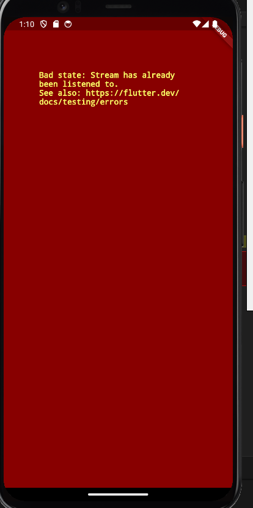

# Week 13 - Pemrograman Asynchronous

Di minggu dua belas ini, mahasiswa akan mempelajari pemrograman asynchronous dan pembuatan projek flutter books menggunakan konsep asynchronous.  

## Penulis

>> [@dzkmrn](https://www.github.com/dzkmrn)

## Praktikum 1: Dart Streams

#### Langkah 1: Siapkan project baru
Buatlah sebuah project flutter baru dengan nama stream_nama (beri nama panggilan Anda) di folder week-13/src/ repository GitHub Anda.

#### Langkah 2: Buka file main.dart
```dart
import 'package: flutter/material.dart';

void main() {
  runApp(const myApp());
}

class MyApp extends StatelessWidget {
  const MyApp({super.key});

  @override
  Widhet build(BuildContext context) {
  return MaterialApp(
    title: 'Stream',
    theme: ThemeData(
      primarySwatch: Color.deepPurple,
    ),
    home: const StreamHomePage(),
  );
  }
}


class StreamHomePage extends StatelessWidget {
  const StreamHomePage({super.key});

  @override
  State<StreamHomePage> createState() => _StreamHomePageState();
}

class _StreamHomePageState extends State<StreamHopePage>{
  @override
  Widget build(BuildContext context) {
    return Container();
  }
}
```

### Soal 1
- Tambahkan nama panggilan Anda pada title app sebagai identitas hasil pekerjaan Anda.
- Gantilah warna tema aplikasi sesuai kesukaan Anda.
- Lakukan commit hasil jawaban Soal 1 dengan pesan "W13: Jawaban Soal 1"

    >> Jawaban: Warna diganti ke lightgreen, kemudian title app diubah menjad "Stream Dzaka"

    

    Sudah di-commit.


#### Langkah 3: Buat file baru stream.dart
Buat file baru di folder lib project Anda. Lalu isi dengan kode berikut.

```dart
import 'package:flutter/material.dart';

class ColorStream{
  
}
```

#### Langkah 4: Tambah variabel colors
Tambahkan variabel di dalam class ColorStream seperti berikut.

```dart
class ColorStream {
  final List<Color> colors = [
    Colors.blueGrey,
    Colors.amber,
    Colors.deepPurple,
    Colors.lightBlue,
    Colors.teal
  ];
}
```

### Soal 2
- Tambahkan 5 warna lainnya sesuai keinginan Anda pada variabel colors tersebut.
    >>Jawaban: 

    ```dart
    Colors.lightBlueAccent,
    Colors.pink,
    Colors.brown,
    Colors.blueAccent,
    Colors.grey
    ```
- Lakukan commit hasil jawaban Soal 2 dengan pesan "W13: Jawaban Soal 2"

    >> Jawaban: Sudah di-commit.

#### Langkah 5: Tambah method getColors()
Di dalam class ColorStream ketik method seperti kode berikut. Perhatikan tanda bintang di akhir keyword async* (ini digunakan untuk melakukan Stream data)

#### Langkah 6: Tambah perintah yield*
Tambahkan kode berikut ini.

```dart
yield* Stream.periodic(
  const Duration(seconds: 1), (int t) {
    int index = t % colors.length;
    return colors[index];
});
```

### Soal 3
- Jelaskan fungsi keyword yield* pada kode tersebut!

    >> Jawaban: Keyword yield digunakan untuk mengembalikan nilai pada stream tersebut sembari program berjalan, hingga tidak ada lagi nilai yang dikembalikan. 

- Apa maksud isi perintah kode tersebut?

    >> Jawaban: Di dalam fungsi tersebut, terdapat perhitungan untuk menentukan nilai yang akan dikirimkan oleh stream. t % colors.length menggunakan operator modulo (%) untuk mendapatkan sisa bagi dari pembagian t dengan panjang dari array colors. Ini menghasilkan indeks dalam array colors berdasarkan waktu yang telah berlalu. Kemudian, nilai yang sesuai dengan indeks ini akan dikirimkan oleh stream.
  
- Lakukan commit hasil jawaban Soal 3 dengan pesan "W13: Jawaban Soal 3"
    >> Jawaban: Sudah di-commit.

#### Langkah 7: Buka main.dart
Ketik kode impor file ini pada file main.dart

```dart
import 'stream.dart';
```

#### Langkah 8: Tambah variabel
Ketik dua properti ini di dalam class _StreamHomePageState

```dart
Color bgColor = Colors.blueGrey
late ColorStream = colorStream;
```

#### Langkah 9: Tambah method changeColor()
Tetap di file main, Ketik kode seperti berikut

```dart
  void changeColor() async {
    await for (var eventColor in colorStream.getColors()) {
      setState(() {
        bgColor = eventColor;
      });
    }
  }
```

#### Langkah 10: Lakukan override initState()
Ketika kode seperti berikut

```dart
@override
void iniState(){
  super.initState();
  colorStream = ColorStream();
  changeColor();
}
```

#### Langkah 11: Ubah isi Scaffold()
Sesuaikan kode seperti berikut.

```dart
return Scaffold(
  appBar: AppBar(
    title: const Text('Stream'),
  ),
  body: Container(
    decoration: BoxDecoration(color: bgColor),
  )
);
```

#### Langkah 12: Run
Lakukan running pada aplikasi Flutter Anda, maka akan terlihat berubah warna background setiap detik.

### Soal 4
- Capture hasil praktikum Anda berupa GIF dan lampirkan di README.
    
    

- Lakukan commit hasil jawaban Soal 4 dengan pesan "W13: Jawaban Soal 4"

    >> Jawaban: Sudah di-commit. 

#### Langkah 13: Ganti isi method changeColor()
Anda boleh comment atau hapus kode sebelumnya, lalu ketika kode seperti berikut.

```dart
colorStream.getColors().listen((eventColor) {
  setState((){
      bgColor = eventColor;
  });
});
```

### Soal 5
- Jelaskan perbedaan menggunakan listen dan await for (langkah 9) !

    >> Jawaban: Perbedaannya terletak pada cara mendengarkan nilai dari stream: await for secara langsung menunggu nilai baru, sementara listen() berfungsi sebagai pemanggilan balik (callback) yang dipanggil setiap kali nilai baru dikirimkan oleh stream. Keduanya akan melakukan hal yang sama dalam hal memperbarui bgColor dengan nilai terbaru dari stream, tetapi dengan pendekatan yang berbeda dalam pemrosesan aliran nilainya.

- Lakukan commit hasil jawaban Soal 5 dengan pesan "W13: Jawaban Soal 5"

    >> Jawaban: Sudah di-commit.

## Praktikum 2: Stream controllers dan sinks

#### Langkah 1: Buka file stream.dart
Lakukan impor dengan mengetik kode ini.

```dart
import 'dart:async';
```

#### Langkah 2: Tambah class NumberStream

Tetap di file stream.dart tambah class baru seperti berikut.

```dart
class NumberStream{

}
```

#### Langkah 3: Tambah StreamController
Di dalam class NumberStream buatlah variabel seperti berikut.

```dart
final StreamController<int> controller = StraemController<int>();
```

#### Langkah 4: Tambah method addNumberToSink
Tetap di class NumberStream buatlah method ini

```dart
void addNumberToSink(int newNumber){
  controller.sink.add(newNumber);
}
```

#### Langkah 5: Tambah method close()

```dart
close() {
    controller.close();
}
```

#### Langkah 6: Buka main.dart
Ketik kode import seperti berikut

```dart
import 'dart:async';
import 'dart:math';
```

#### Langkah 7: Tambah variabel
Di dalam class _StreamHomePageState ketik variabel berikut

```dart
int lastNumber = 0;
late StreamController numberStreamController;
late NumberStream numberStream;
```

#### Langkah 8: Edit initState()

```dart
@override
void initState() {
    numberStream = NumberStream();
    numberStreamController = numberStream.controller;
    Stream stream = numberStreamController.stream;
    stream.listen((event){
        setState((){
            lastNumber = event;
        });
    });
    super.initState();
}
```

#### Langkah 9: Edit dispose()

```dart
@override
void dispose () {
    numberStreamController.close();
    super.dispose();
}
```

#### Langkah 10: Tambah method addRandomNumber()
```dart
void addRandomNumber() {
  Random random = Random();
  int myNum = random.nextInt(10);
  numberStream.addNumberToSink(myNum);
}
```

#### Langkah 11: Edit method build()

```dart
body: SizedBox(
    width: double.infinity,
    child: Column(
        mainAxisAlignment: MainAxisAlignment.spaceEvenly,
        crossAxisAlignment: CrossAxisAlignment.center,
        children: [
            Text(lastNumber.toString()),
            ElevatedButton(
                onPressed: () => addrandomNumber(),
                child: Text('New Random Number'),
            )
        ].
    ),
)
```

#### Langkah 12: Run
Lakukan running pada aplikasi Flutter Anda, maka akan terlihat seperti gambar berikut.

### Soal 6
- Jelaskan maksud kode langkah 8 dan 10 tersebut!

    >> Jawaban: Di langkah 8 (initState()), proses initState() dipanggil saat widget pertama kali dibuat. Di sini, objek NumberStream dibuat dan numberStreamController diinisialisasi menggunakan controller dari NumberStream. Kemudian, sebuah Stream diinisialisasi dari controller dan dipantau dengan listen() untuk mendapatkan nilai-nilai dari stream tersebut. Ketika nilai baru diterima, setState() dipanggil untuk memperbarui lastNumber dengan nilai terbaru dari stream. Langkah ini memastikan bahwa widget merespons perubahan pada stream dengan memperbarui tampilan sesuai dengan nilai terbaru yang diterima. Di langkah 9 (dispose()), proses dispose() dipanggil saat widget dihapus dari tampilan. Pada langkah ini, numberStreamController ditutup dengan memanggil metode close() untuk membersihkan sumber daya yang digunakan oleh controller stream. Ini merupakan praktik yang baik untuk memastikan bahwa sumber daya yang terkait dengan stream atau controller dilepaskan dengan benar saat widget tidak lagi digunakan, mencegah kebocoran memori atau masalah sumber daya lainnya.

- Capture hasil praktikum Anda berupa GIF dan lampirkan di README.
    
- Lalu lakukan commit dengan pesan "W13: Jawaban Soal 6".
    >> Jawaban: Sudah di-commmit.

  
#### Langkah 13: Buka stream.dart
Tambahkan method berikut ini.

```dart
addError(){
    controller.sink.addError('error');
}
```

#### Langkah 14: Buka main.dart
Tambahkan method onError di dalam class StreamHomePageState pada method listen di fungsi initState() seperti berikut ini.

```dart
stream.listen((event){
    setState((){
        lastNumber = event;
    });
    }).onError((error){
    setState(() {
        lastNumber = -1;
    });
});
```

#### Langkah 15: Edit method addRandomNumber()
Lakukan comment pada dua baris kode berikut, lalu ketik kode seperti berikut ini.

```dart
void addRandomNumber(){
    Random random = random();
    // int myNum = random.nextInt(10);
    // numberStream.addNumberToSink(myNum);
    numberStream.addError();
}
```

### Soal 7
- Jelaskan maksud kode langkah 13 sampai 15 tersebut!

  >> Jawaban: Pada langkah 14, ditambahkan method onError di dalam StreamHomePageState untuk menangani kesalahan yang mungkin terjadi pada stream yang sedang dengarkan. Ini memungkinkan kita untuk mengubah lastNumber menjadi -1 ketika terjadi error dalam stream. Pada langkah 15, dalam method addRandomNumber(), daripada menambahkan angka acak ke dalam stream, kita menggunakan numberStream.addError() untuk sengaja menimbulkan error di dalam stream. Akibatnya, onError yang sudah ditambahkan sebelumnya akan menangkap error tersebut dan mengubah lastNumber menjadi -1 sesuai dengan penanganan error yang sudah ditetapkan sebelumnya.

  

- Kembalikan kode seperti semula pada Langkah 15, comment addError() agar Anda dapat melanjutkan ke praktikum 3 berikutnya.
  >> Sudah.
- Lalu lakukan commit dengan pesan "W13: Jawaban Soal 7".
  >> Sudah di-commit.

## Praktikum 3: Injeksi data ke streams

#### Langkah 1: Buka main.dart
Tambahkan variabel baru di dalam class _StreamHomePageState

```dart
late StreamTransformer transformer;
```

#### Langkah 2: Tambahkan kode ini di initState

```dart
transformer = StreamTransformer<int, int>.fromHandlers(
    handleData: (value,sink){
        sink.add(value * 10);
    },
    handleError: (error,trace,sink){
        sink.Add(-1);
    },
    handleDone: (sink) => sink.close());
```

#### Langkah 3: Tetap di initState
Lakukan edit seperti kode berikut.

```dart
stream.transform(transformer).listen((event){
    setState((){
        lastNumber = event;
    });
}).onError((error){
    setState((){
        lastNumber = -1;
    });
});
super.initState();
```

#### Langkah 4: Run
Terakhir, run atau tekan F5 untuk melihat hasilnya jika memang belum running. Bisa juga lakukan hot restart jika aplikasi sudah running. Maka hasilnya akan seperti gambar berikut ini. Anda akan melihat tampilan angka dari 0 hingga 90.

### Soal 8
- Jelaskan maksud kode langkah 1-3 tersebut!

  >> Jawaban: 
Langkah-langkah tersebut menambahkan kemampuan transformasi pada sebuah Stream di aplikasi Dart. Pertama, dengan mendefinisikan variabel transformer sebagai StreamTransformer, kita siapkan objek untuk mengubah data dalam stream. Di initState, transformer diatur untuk mengalikan nilai input dengan 10 dalam handleData dan menetapkan nilai -1 saat ada error dalam handleError. Langkah terakhir menghubungkan transformer ke stream yang di-observe. Ketika data masuk, transformasi akan diterapkan. Jika terjadi error, penanganan error akan mengubah lastNumber menjadi -1, mengindikasikan adanya masalah dalam stream. Ini memungkinkan pengelolaan data masuk serta penanganan error dengan lebih efektif dalam proses observasi stream.

- Capture hasil praktikum Anda berupa GIF dan lampirkan di README.

  

- Lalu lakukan commit dengan pesan "W13: Jawaban Soal 8".

  >> Sudah di-commit.
  
## Praktikum 4: Subscribe ke stream events

#### Langkah 1: Tambah variabel
Tambahkan variabel berikut di class _StreamHomePageState

```dart
late StreamSubscription subsctiption;
```

#### Langkah 2: aEdit initState()
Edit kode seperti berikut ini.

```dart
@override
void initState() {
    numberStream = NumberStream();
    numberStreamController = NumberStream.controller;
    Stream stream = numberStreamController.stream;
    subscription = stream.listen((event){
        setState((){
            lastNumber = event;
        });
    });
    super.initState();
}
```

#### Langkah 3: Tetap di initState()
Tambahkan kode berikut ini.

```dart
subscription.onError((error){
    setState((){
        lastNumber = -1;
    };)
});
```

#### Langkah 4: Tambah properti onDone()
Tambahkan dibawahnya kode ini setelah onError

```dart
subscription.onDone((){
    print('OnDone was called');
})
```

#### Langkah 5: Tambah method baru
Ketik method ini di dalam class _StreamHomePageState

```dart
void stopStream(){
    numberStreamController.close();
}
```

#### Langkah 6: Pindah ke method dispose()
Jika method dispose() belum ada, Anda dapat mengetiknya dan dibuat override. Ketik kode ini didalamnya.

```dart
subscription.cancel();
```

#### Langkah 7: Pindah ke method build()
Tambahkan button kedua dengan isi kode seperti berikut ini.

```dart
ElevatedButton(
    onPressed: () => stopStream(),
    child: const Text('Stop Subscription'),
)
```

#### Langkah 8: Edit method addRandomNumber()
Edit kode seperti berikut ini.

void addRandomNumber(){
    Random random = Random();
    int myNum = random.nextInt(10);
    if (!numberStreamController.isClosed){
        numberStream.addNumberToSink(myNum);
    }else{
        setState((){
            lastNumber = -1;
        });
    }
}

#### Langkah 9: Run
Anda akan melihat dua button seperti gambar berikut.

#### Langkah 10: Tekan button ‘Stop Subscription'
Anda akan melihat pesan di Debug Console seperti berikut.

### Soal 9
- Jelaskan maksud kode langkah 2, 6 dan 8 tersebut!

>> Jawaban: Langkah 2 memperbaiki inisialisasi dan pengaturan stream serta subscription pada method initState(), memungkinkan pemantauan perubahan stream untuk memperbarui nilai lastNumber yang tercermin dalam tampilan. Langkah 6 menambahkan fungsi stopStream() ke dalam dispose() agar ketika widget tidak lagi digunakan, numberStreamController dapat ditutup dengan aman, sementara langkah 8 memperbaiki metode addRandomNumber() untuk menambahkan nomor acak ke dalam stream hanya jika stream masih terbuka, sehingga memastikan keberlangsungan operasi tambahan.

- Capture hasil praktikum Anda berupa GIF dan lampirkan di README.


- Lalu lakukan commit dengan pesan "W13: Jawaban Soal 9".

>> Sudah di-commit.

## Praktikum 5: Multiple stream subscriptions

#### Langkah 1: Buka file main.dart
Ketik variabel berikut di class _StreamHomePageState

```dart
late StreamSubscription subscription2;
String values = '';
```

#### Langkah 2: Edit initState()
Ketik kode seperti berikut.

```dart
subscription = stream.listen((event){
  setState((){
    values += ' $event - ';
  });
});

subscription2 = stream.listen((event){
  setState((){
    values += ' $event - ';
  });
});
```

#### Langkah 3: Run
Lakukan run maka akan tampil error seperti gambar berikut.



#### Soal 10
- Jelaskan mengapa error itu bisa terjadi ?
>> Jawaban: Error "Bad state: Stream has already been listened to" terjadi ketika kita mencoba mendengarkan stream yang sama lebih dari sekali. Dart tidak mengizinkan stream untuk didengarkan lebih dari satu kali, kecuali jika kita menggunakan asBroadcastStream() untuk mengonversi stream menjadi stream yang dapat didengarkan beberapa kali (broadcast).

#### Langkah 4: Set broadcast stream
Ketik kode seperti berikut di method initState()

```dart
void initState(){
  numberStream = NumberStream();
  numberStreamController = numberStream.controller;
  Stream stream = numberStreamController.stream.asBrodcastStream();
}
```

#### Langkah 5: Edit method build()
Tambahkan text seperti berikut

```dart
child: Column(
          mainAxisAlignment: MainAxisAlignment.spaceEvenly,
          crossAxisAlignment: CrossAxisAlignment.center,
          children: [
            Text(values),
          ]
```

#### Langkah 6: Run
Tekan button ‘New Random Number' beberapa kali, maka akan tampil teks angka terus bertambah sebanyak dua kali.

### Soal 11
- Jelaskan mengapa hal itu bisa terjadi ?

  >> Jawaban: Ketika dua subscription ditambahkan ke stream yang sama pada langkah 2, keduanya berlangganan pada peristiwa yang sama di dalam stream. Ini menyebabkan setiap peristiwa baru dalam stream dieksekusi oleh kedua subscription, mengakibatkan nilai dari peristiwa tersebut ditambahkan dua kali ke variabel values. Kemudian, menggunakan asBroadcastStream() pada stream pada langkah 4 membuat setiap subscription yang terpasang pada stream menerima setiap peristiwa yang terjadi di dalam stream. Hasilnya, nilai peristiwa tersebut ditambahkan dua kali ke dalam values setiap kali button 'New Random Number' ditekan.

- Capture hasil praktikum Anda berupa GIF dan lampirkan di README.

  

- Lalu lakukan commit dengan pesan "W13: Jawaban Soal 10,11".

>> Jawaban: Sudah di-commit. 


